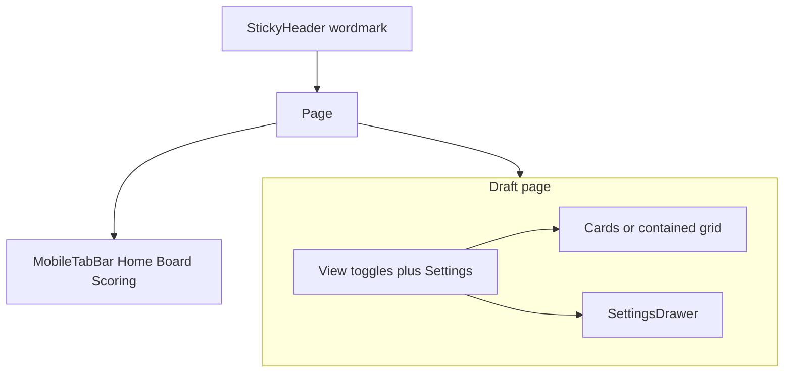

# Design system and mobile UX

UI-only pass before the next product phase. Quiz order stays play, league, review. Ranker, `POST /rank`, and `dd.draftProfile` stay put. Display caps and view state live in the client. No app code in the first commit of this work. This document is the starting point.

Color: **ink buttons, duck-blue as accent only.** `#78A3CF` remains the brand wash (progress, your-pick, links). Primary actions are dark ink on paper. Light theme and Public Sans stay locked.

This pass overrides one line in [quiz-centered-ux.md](quiz-centered-ux.md): stances are not an always-visible bar on the board. They live in a Settings drawer on `/draft` only. The quiz never opens a drawer.

## Why it looks generic today

- Tokens in `app/client/src/styles/global.css`: zinc-50 paper, washed `#78A3CF` buttons with dark text, leftover `dark:` classes in the button kit.
- Colored eyebrow labels on every page (`Category quiz`, `Board`, `Step 1 of 3`) are the same habit as uppercase kickers, which the aesthetic rule already bans.
- `PageShell` is `py-10` with nav after the content. Quiz already has a sticky footer. Marketing and the board do not. Thumbs cannot reach Home, Board, or Scoring.
- Simple vs full is a history push (`view=simple`, no `replace`). Assist and raw/+/- already `replace: true`. Combined with `scrollRestoration: true` and a ternary remount of `PlayerTable`, window scroll jumps to top. Simple view still mounts the full cat grid of slot rows. `fitMarks` and `whyCopy` already exist in core and are unused on the board.
- The table is `min-w-[76rem]` (1216px) inside `overflow-x-auto` with no max height, inside a `max-w-6xl` (1152px) shell. It overflows even on desktop. Vertical sticky never engages because the overflow box is the containing block and is as tall as the table.
- Full board renders the whole ranked CSV: about 452 players (20-game filter, no client cap). Assistance last round dumps everyone past a full roster. Cap is display-only. Do not change `partitionByRound`.
- Settings and stances use `
`. StanceBar is nine rows of three outline buttons.

## 1. Tokens and aesthetic lock

Update `app/client/src/styles/global.css` and `.cursor/rules/design-aesthetic.mdc`:

- Paper slightly warmer than zinc-50. Ink foreground. Subtle card lift, still one hue.
- `--primary` becomes ink for buttons (`primary-foreground` light). `--brand` / `--ring` stay `#78A3CF` for progress, links, your-pick fill.
- Keep: Public Sans, light only, rem spacing, px radius 8, no pills, no second typeface, no saturated gradients.
- Drop colored eyebrows. Hierarchy from size and weight.
- Tighten `baseline.css`: less page padding on small screens, smaller mobile `h1` (`text-2xl md:text-4xl`). `md:` is size and width, not a second layout.
- Strip unused `dark:` utilities from the button kit.

## 2. Mobile-first chrome

Lift nav out of page bottoms.

- Sticky top header: wordmark. Desktop also gets Home, Scoring, About, Board (Board only after hydrate).
- Mobile tab bar: Home, Board (if profile), Scoring. About stays on Scoring and Home, not a fourth tab.
- Hide the tab bar on `/onboard` so it does not fight sticky Back / Continue. Hide desktop header links too. The quiz is a funnel, not a site page. Wordmark is the exit home. Drop the extra in-page Draft Duck link on onboard.
- Safe-area padding. Controls at least 2.75rem tall.
- `PageShell`: less vertical padding. Draft stays wide. Quiz shell uses a tighter top inset than marketing pages.

## 3. Drawer on the draft board only

No Sheet, Drawer, or Dialog exists today. Add a shadcn Drawer and use it **only on `/draft`**. Quiz (`/onboard`) must not open any overlay. First-run stays a page of steps with sticky Back / Continue.

**Draft:** one Settings control. Drawer holds league, categories, intensity, and the punt/stance editor. View toggles stay on the page (simple/full, assistance, raw/+/-). `lucide-react` is already a dependency. Use it as a leading icon next to the word Settings.

Board chrome shows a one-line build summary (`Need REB, BLK · Punt FT%`) that opens the drawer. StanceBar comes off the always-visible board. The drawer is the editor. The summary is the reminder.

**Quiz:** same three steps, no drawer. Treat it as a funnel: one question, one job, then Continue. Play still tap-to-advance.

### Quiz funnel (play, league, review)

The current shell stacks a home link, a primary Step N of 3 kicker, a progress bar, a homepage-sized `h1`, and a README description before the actual choice. That reads like a settings wizard, not a short path.

**Chrome.** Quiet progress only (thin bar or three dots). `aria-label` can still say step N of M. No colored Step 1 of 3. Title is the question, `text-xl` / `md:text-2xl`, not the marketing `h1`. One optional muted line under it, or none if the title is enough. Restore banner is a single muted sentence, not a fourth header.

**Spacing.** Tight cluster for progress + title. Then the answer block. Related controls sit close (`gap-2` label + chips). Separate questions on League sit further apart (`gap-6` to `gap-8`). Do not stretch empty `flex-1` so the first chip floats in the middle of the phone. Content starts under the title. Sticky footer stays. Continue is the only filled button. Back is outline and secondary.

**Play.** Title is enough (How do you want to play?). Drop the stance-map sentence, or one quiet line: Tap a build to continue. Cards stack on a phone. `md:` may be two columns but Custom stays last and quieter, not a seventh equal tile. Tight card padding (name + helper, not dashboard tiles). Tap still advances. Do not add Continue to this step.

**League.** Four fields stay on one step (order is locked). Make it scan as four short questions, not a form dump: League size, Rounds, Draft type, Your pick. Short labels, no paragraph description in the shell. Slot stays chips here (select is drawer-only). Defaults are already sensible. Do not add extra helper essays.

**Review.** Pick preview is the payoff, not a recap dump. Short title (Your picks, or keep Review) plus one line of why those names. Adjust Need and Punt is a quiet in-place expand below the list, collapsed by default, especially on named builds. Fine-tune is a second in-place expand inside that, Custom only. Sticky Rank my board stays the obvious end of the funnel.

**Copy for STEPS.** Play: no description, or Tap a build. League: none. Review: If everyone took this board in order, these are the names at your pick. Continue labels stay Continue / Rank my board.

## 4. Stance control

Replace three separate outline buttons per cat with one segmented bar per cat (`role="radiogroup"`, Need / Neutral / Punt). `rounded-lg`, not a pill. Selected segment uses ink or a quiet brand wash. Punt is muted, not red.

Keep `ChoiceRow` for league size and draft type. Do not restyle those into the same segment control if they wrap badly. League slot can become a compact select inside the draft drawer (14 chips is a lot on a phone).

## 5. Simple vs full without a remount

- Move simple/full to React state inside `DraftBoard`. Default simple when `draftSlot` is set (same as today's `boardSearch`). Stop writing `view` into the URL. Browser back is not required.
- Keep `assist` and `values` in search, but `replace: true` and `resetScroll: false` so those toggles do not jump the page.
- **Simple** becomes pick cards: round, overall pick, name, pos, up to three `fitMarks`, one `whyCopy` line. No cat grid, no heat legend. Helpers already exist in core.
- **Full** is the spreadsheet, in a contained scroller.

## 6. Grid scroll and list length

- Give the full table a viewport-bounded scroller (`max-h` + `overflow-auto`) so one region scrolls both axes and thead / rank can stick inside it.
- Hide Team on small screens. Narrower identity columns. Table stats may use `text-sm`. Names stay `text-base`.
- Display cap: show `leagueSize * draftRounds` (156 on a 12 x 13). Assistance rounds 1..N-1 stay full width. The last-round dump and the unaided list are what get clipped. Show rest of board reveals the remainder. A name search queries the full ranked set and lifts the cap. No API `limit`.

## 7. Copy

Rewrite so it reads like a person, not a repo README. Short sentences. Scan, do not lecture.

- Drop eyebrows (`Category quiz`, `Board`, `About`).
- About: no `localStorage` keys, Fastify, or CSV. Answer a few questions. We rank this year's players for that profile. Nothing to sign up for. Answers stay on this device.
- Scoring: Need counts more, Punt counts as zero, assistance only slices the list. Math can stay, in smaller bites.
- Home hook can stay. Cut CAT profile jargon where a normal word works.
- Quiz step chrome: question titles, almost no description. Funnel, not a spec.
- Draft header is the headline (`Fortress · 12-team snake · pick 7`), not Ranked for your CAT profile.
- Root meta still reads like a spec (weighted ranks, optional round buckets). Rewrite to match the home hook.

Do not change named-build labels or helper maps.

## 8. Extras (same implementation PR)

These are how the core choices stay usable, not polish to skip.

**Compact heat legend.** Full table only. Three swatches plus a short line, no paragraph. Move punted cats stay uncolored into the Settings drawer next to stances, where it is about the build. Drawback: people who never open Settings will not read that rule. Acceptable because punted columns already look empty of color.

**Drawer a11y.** Focus trap, labelled close, `aria-labelledby`, Esc to dismiss, restore focus to the Settings control. Lock body scroll while open. Drawback: iOS body-lock is still flaky if the table scroller is also `overflow-auto`. Test the open drawer on a phone over the grid. If both rubber-band, prefer locking the page and keeping the drawer as the only scroll.

**Fine-tune in place.** On the board, intensity lives in the Settings drawer under stances, collapsed behind Fine-tune weights that expands in that same drawer (not a nested overlay). On the quiz, the same expand is an on-page section on Review. No quiz drawer. Drawback: Review gets longer when both stances and sliders are open, and the sticky Continue sits under that scroll. That is better than covering the pick preview with a sheet during first run.

**Remember simple vs full.** `sessionStorage` key (e.g. `dd.boardView`) so a full-table user is not bounced back to simple on refresh. Still not in the URL. Drawback: two tabs can disagree. A shared link cannot open full table. That is the cost of dropping back-button support.

**Settings is a word, not an icon.** Label it Settings. Lucide is fine as a leading icon. Icon-only reads as another AI dashboard. Drawback: one more word in a tight toolbar. Wrap the toolbar. Do not shrink type under `text-base`.

**Keep the drawer open across re-rank.** Stance and league changes still `POST /rank` immediately. Do not unmount the drawer when `profile` updates. Show Updating board… in the drawer, not a page-level banner that feels like a navigation. Drawback: the user cannot see rows move unless the board is visible behind the sheet. On a phone the bottom sheet covers most of the list. Desktop side sheet leaves the table visible. On a phone, the build summary line above the board is enough until they close. Do not add a live mini-preview in this pass.

**Slot control in the drawer.** Replace the 8-14 wrap chips with a native select (or shadcn Select) for pick number only. League size and snake/linear stay chips. Drawback: you cannot see every slot at once. Fine inside a sheet. Keep chips on the quiz League step so first-run scan does not change.

**Pick cards use the unused Card primitive.** Simple view should not invent a third surface. Drawback: shadcn Card padding can look even and generic. Override to tight grouping (name + marks tight, why-line muted, round label smaller).

**Chrome offset.** Tab bar and sticky header steal vertical space. PageShell and the table `max-h` must subtract header + toolbar + tab bar + safe area, or the contained scroller becomes a second page scroll. Drawback: one more layout constant to keep in sync. Put the offset in a shared CSS variable (`--app-header`, `--app-tabs`).

**Not in this pass.** Row virtualization (cap makes 156 rows enough). Nested drawers. Quiz drawers (none). Cycle-on-tap stance chips. Live mini-board inside the sheet. Putting view toggles in the drawer.

## Drawbacks

**Ink buttons.** The pale blue fill is the current brand on every CTA. Ink-first can look like a docs site until you hit a link or the progress bar. Selected named-build cards will go dark, which is heavier than today's tint. If that feels wrong on the implementation PR, fall back to a darker `#78A3CF` sibling for `default` buttons only, keep ink for text.

**Stances in a drawer (board only).** Quiz-centered-ux wanted a tap on the board to be a slice of the quiz. An extra tap to open Settings makes the board calmer and the loop slower. Power users who punt-tune while reading the grid will feel it. The summary line is a reminder, not an editor. Live re-rank inside the open drawer is the mitigation. Do not also keep a mini StanceBar on the page (two editors will drift). Quiz Review still edits stances on the page, so first-run and the board are different chrome on purpose.

**Quiz in-place expand.** Dropping `
` without a drawer means Review can become a long scroll (preview + nine stance rows + optional sliders). Sticky Continue still works, same as League. Named-build users who never open Adjust build keep the short preview. Do not auto-expand stances on named builds.

**Quiz is still three steps, not six.** League packs four questions on one screen. Splitting them would feel more funnel and would change the step order, which we will not do. Grouping and spacing are the mitigation. Play tap-to-advance can mis-tap. Keep it so the first screen is one gesture, not title + cards + Continue.

**Funnel vs site chrome.** Hiding header links and tabs on `/onboard` makes Scoring/About unreachable until the user exits. That is the point. Wordmark is the way out. Returning users who opened Retake still need a visible exit. Do not trap them.

**Simple/full out of the URL.** `/draft?view=simple` and browser back stop working. Refresh with no sessionStorage returns to simple whenever a slot exists. Assist and raw/+/- stay shareable. View does not. That split is slightly inconsistent, on purpose: view is chrome, assist/values change what the list means.

**Display cap.** M4's last round exists so late names are not dropped. Hiding everyone past `leagueSize * draftRounds` (about 156 of 452) will hide fit-rises that fell after the roster. Search and Show rest of board are easy to miss. Do not change `partitionByRound`. The caption on the full table should say we are showing the draft, not the universe. Search that lifts the cap can return a 452-row table and recreate the original problem. Keep that. Finding one name matters more than the cap.

**Two board widgets.** Quiz-centered-ux said keep one `PlayerTable`. Cards vs grid will drift (why-copy on cards only, heat only on the grid). That split is the point of simple vs full. Live with one shared `fitMarks` / `whyCopy` helper so copy cannot fork.

**Contained two-axis scroller.** Nested `overflow-auto` is what already broke sticky thead. Bounding the height is what makes sticky work inside the box, but iOS two-axis scroll is still janky, and identity columns still eat a phone. Full table on a phone will always need horizontal pan. Simple cards are the phone path. Do not try to make 9 cat columns comfortable at 390px.

**Tab bar.** Header + draft toolbar + tabs + safe area leave a short grid. Board tab missing until hydrate will shift the bar. About is one step further away. Quiz hides the bar so Continue stays free. Marketing and draft do not match that chrome, which is fine.

**Segmented Need/Neutral/Punt.** Tighter than three buttons, still a settings-app control. Cycle-on-tap chips would be denser and less obvious (how do I punt?). Prefer obvious in a drawer we already made room for.

**Copy that hides the stack.** About will no longer mention Fastify or `dd.draftProfile`. Scoring stays for the math. Contributors lose an in-app pointer to the persist key. That belongs in docs, not the product.

## Out of scope

Quiz order, ranker formulas, availability floor, ADP, taken list, dark mode, second typeface, accounts. No `POST /rank` body change. No quiz drawers.

## Suggested build order

1. Tokens and aesthetic lock.
2. App chrome (header, tab bar, PageShell). Quiz funnel shell in the same pass.
3. Draft Settings drawer, segmented stances, quiz in-place expand.
4. Simple pick cards, contained table, display cap, sessionStorage view.
5. Copy pass.
6. Extras that are not already implied (legend, a11y, chrome offsets).
7. Browser-check mobile and desktop. Change note. Mark this PR ready.

## How to judge it

1. Phone: Home, Scoring, and Board are reachable without scrolling past the page. Quiz Continue is not fighting a tab bar.
2. Quiz: play tap, league grouped, review preview then collapsed adjust. No overlay. Order unchanged.
3. Draft: Settings opens a drawer. View toggles stay on the page. Stances are not nine rows of three buttons above the list.
4. Simple vs full does not jump scroll. Simple is cards, not a 76rem grid of 13 rows.
5. Full table scrolls in one region. Default list is draft-length, not 452 rows. Search can still find a name past the cap.
6. Copy does not mention Fastify, CSV, or `localStorage` keys on About.

## Reference

- [quiz-centered-ux.md](quiz-centered-ux.md)
- [M3-onboarding.md](../M3-onboarding.md)
- [M4-draft-assistant.md](../M4-draft-assistant.md)
- [00-product-and-stack.md](../00-product-and-stack.md)
- [2026-09-20-draft-board-heatmap.md](../changes/2026-09-20-draft-board-heatmap.md)
- [2026-09-21-tanstack-start.md](../changes/2026-09-21-tanstack-start.md)
- [2026-09-22-ranking-availability.md](../changes/2026-09-22-ranking-availability.md)
