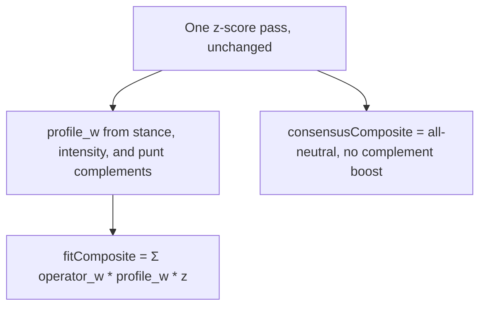

# Punt complement reweight

Plan only. Ranker math, `POST /rank`, and named-build maps stay as they are on this branch. The next PR on this same branch should implement **Approach B**, including the StanceBar / Fine-tune gates in [UI controls](#ui-controls).

## The claim

Z-scores rank players neutrally. When you punt a category, other categories may be worth more.

Two different readings:

1. **The punted cat is worth nothing, so the rest decide the board.** Already true.
2. **The remaining cats are not equal.** Complements of the hole (punt FT% -> FG% / REB / BLK) should outweigh leftover Neutrals (3PM, AST). Only true today if the user marks those complements Need.

Reading 1 is ranking. Reading 2 is build strategy. Custom punt-only does reading 1. Named builds do both.

## What the ranker does today

[`rank()`](app/core/src/ranker.ts) is one z-score pass, then:

```text
composite = Σ operator_w[c] * profile_w[c] * z[c]
profile_w[c] = stanceWeight * (intensity[c] ?? 1)
```

| Stance    | Weight |
| --------- | ------ |
| `need`    | `1.5`  |
| `neutral` | `1`    |
| `punt`    | `0`    |

Punt keeps the cat in `z` and zeroes it in the sum. Disabled cats are omitted from `z` entirely. Need is the only lever that makes a remaining cat worth more than Neutral. Operator JSON is still all `1`.

Named builds already write the classic clusters as Need, not as extra ranker math:

| Build    | Punt | Need                    |
| -------- | ---- | ----------------------- |
| Fortress | FT%  | FG%, REB, BLK, PTS      |
| Bricks   | FG%  | REB, BLK, FT%           |
| Post     | AST  | PTS, REB, BLK, FG%      |
| Sniper   | BLK  | PTS, 3PM, FT%, AST, STL |
| Stocks   | PTS  | STL, BLK                |
| Balanced | —    | all Neutral             |

Custom can punt FT% and leave every other cat Neutral. The ranker then treats the leftover eight as equal.

### Season dump check (2025-26 CSV, floor off)

Consensus vs custom **punt FT% only** vs **Fortress** (Need + punt):

| Player      | Consensus | Punt FT% only | Fortress |
| ----------- | --------- | ------------- | -------- |
| Giannis     | 47        | 5             | 3        |
| Gobert      | 85        | 13            | 10       |
| Curry       | 10        | 27            | 38       |
| Harden      | 18        | 52            | 73       |
| Maxey       | 5         | 6             | 13       |
| Trey Murphy | 15        | 21            | 30       |

Zeroing FT% is enough to lift the players that cat was punishing. Need is what then prefers Duren / Allen / Gobert over Maxey / Murray / Murphy.

Top-24 overlap, punt-FT% only vs Fortress: 21/24. The gap is real and small, and it is exactly the complement cluster.

Uniform 9/8 scale on the leftover weights: **same order** as punt-only. Confirmed on this CSV. Spreading the punted weight evenly cannot be the fix.

Z-correlations on the consensus top 200, for context:

- FT% vs FG% / REB / BLK: about -0.33 / -0.33 / -0.29
- FG% vs 3PM: about -0.61
- AST vs TOV (inverted z): about -0.79

The anti-correlations are in the data. They already move punt-only boards. Extra weight is for tilting leftover Neutrals, not for discovering the cluster.

## Verdict

The ranker **does** reflect “punt makes that cat not count.” It **does not** automatically make complements worth more than other remaining cats. Named builds paper over that with Need 1.5. Custom punt-only does not.

Do not ship a uniform reweight. Do not hide a third weight layer inside `SuggestionHook`. Keep z-scores, operator JSON, and stance weights.

## Approaches

### A. Docs and quiz only

Need stays the complement lever. Scoring copy already says Need 1.5 / Punt 0. Custom that punts without Need gets an honest 8-way Neutral board.

Pros: no rank-order surprise, existing goldens untouched, matches “the quiz sets the weights.” StanceBar and Fine-tune stay exact: Neutral is 1, the slider number is the weight.

Cons: a Custom FT% punt still ranks Maxey like a punt-FT% cornerstone. Users who mean “Fortress” and only flip Punt do not get the cluster.

Ship this only if we decide Custom punt-only is a feature.

### B. Static complement boost on leftover Neutrals (recommended)

When the profile is **punt-only** (at least one Punt, zero Need) and Fine-tune was never persisted, look up complements from a static map (the named-build Need lists, inverted). Remaining Neutral complements get **1.25**. Need stays 1.5. Punt stays 0. Any Need chip or any Fine-tune map turns the bump off so the controls stay the source of truth. See [UI controls](#ui-controls).

```text
if punt: 0
else if need: 1.5 * (intensity ?? 1)
else if boostEligible and cat is a complement of a punted cat:
    1.25
else: 1 * (intensity ?? 1)

boostEligible =
  puntComplementBoost
  and profile has at least one punt
  and profile has no Need cats
  and profile.intensity is omitted
```



Source of the map: invert [`NAMED_BUILDS`](app/core/src/named-builds.ts) so we do not maintain two cluster lists. Multi-punt unions the Need lists and drops cats that are themselves punted.

| Punt | Complements             |
| ---- | ----------------------- |
| FT%  | FG%, REB, BLK, PTS      |
| FG%  | REB, BLK, FT%           |
| AST  | PTS, REB, BLK, FG%      |
| BLK  | PTS, 3PM, FT%, AST, STL |
| PTS  | STL, BLK                |

No named build punts TOV, STL, 3PM, or REB. Those punts get no auto-boost until we add a row on purpose.

Flag in [`ranker.json`](app/core/config/ranker.json), same pattern as `availabilityFloor`: `puntComplementBoost` default **true** in the implementation PR after goldens. `RankOptions.puntComplementBoost` overrides in tests. Consensus composite stays all-neutral with no boost so `consensusRank` remains “balanced 9-cat.”

Named builds stay bit-identical for two reasons: complements are already Need 1.5, and the zero-Need gate would skip them anyway. Custom punt-FT% with no Fine-tune is the board that changes.

Pros: Custom punt-FT% tilts toward the big-man cluster without rewriting chips or sliders. Named builds, mixed Need+Punt, and Fine-tune keep today’s weights. Inspectable named-build source. No weekly data.

Cons: a Custom user who only flips Punt, never Need, never Fine-tune, still gets a Neutral chip that ranks as 1.25. Mitigate with Scoring plus a Settings one-liner, and keep the flag.

This is the one to implement.

### C. Correlation-derived weights

Recompute Pearson of z-scores (full universe or top-N) and scale remaining cats by how negatively they correlate with the punted cat.

A probe on this CSV, punt FT%, `intensity = 1.1 - 0.4 * r`:

- Boosted REB / BLK / FG% / inverted TOV (~1.23)
- Cut PTS / 3PM (~0.88)
- Gobert 13 -> 7, Curry 27 -> 52, Harden 52 -> 93

Stronger and noisier than Fortress. TOV sign is easy to get wrong because z is inverted. Weights change when the CSV or min-games filter changes. Hard to explain next to Need 1.5.

Reject for v1. Maybe a later operator experiment, not profile math.

### D. Uniform renormalize

Scale leftover weights so they still sum to nine. Ranking order is identical to today. Reject.

### E. Weekly G-score / H2H leverage

Downweight volatile cats (steals) by week-to-week variance, or weight by category-win probability after a punt. Needs game logs we do not have. Out of scope. Same bucket as VORP / remaining-pool re-z.

### F. Amplify Need when any punt exists

Leave Neutral at 1. If the profile has a punt, raise Need from 1.5 to ~1.8.

Only helps named builds and Custom users who already marked Need. Custom punt-only still treats leftovers equally. Weaker than B for the reported case. Do not do this instead of B.

## UI controls

The ranker must not make Need / Neutral / Punt or Fine-tune mean something other than what the chrome shows. Those controls are the product.

### Where they live

| Surface        | Control                                                                                                                                                   | Who sees it     |
| -------------- | --------------------------------------------------------------------------------------------------------------------------------------------------------- | --------------- |
| Home gallery   | Named build writes a full stance map. Custom writes all Neutral. No sliders.                                                                              | First run       |
| Quiz review    | Expand **Adjust Need and Punt**: [`StanceBar`](app/client/src/components/onboard/steps/stances-step.tsx). Fine-tune only when `archetypeId === 'custom'`. | Review          |
| Draft Settings | Same StanceBar for every profile. **Fine-tune weights** expand for named builds too.                                                                      | `/draft` drawer |
| Scoring        | Copy: Need 1.5, Neutral 1, Punt 0; intensity 0–2 scales a non-punt cat.                                                                                   | `/how-it-works` |

[`StanceBar`](app/client/src/components/onboard/steps/stances-step.tsx) is three segments per enabled cat. Punt is muted, not red. Changing a segment only writes `stances[cat]`. It does not move other cats’ segments and does not clear intensity.

[`IntensitySlider`](app/client/src/components/onboard/intensity-slider.tsx) is 0–2, step 0.1, label **Less / More**, number shown is `intensity[cat] ?? 1`. Punt disables that slider so intensity is not written for the hole. Hint: “How hard to lean into each remaining cat. 1 is the default.”

First slider input sets `includeIntensity: true`. [`quizDraftToProfile`](app/client/src/lib/quiz.ts) then writes **every** non-punt cat as `intensity[cat] ?? 1`. Opening Fine-tune without moving a thumb does not persist intensity. Expanding Fine-tune on a named board and nudging one cat persists 1.0 on the rest.

Board chrome [`stanceSummary`](app/core/src/named-builds.ts) only lists Need and Punt. Neutrals are silent. [`whyCopy`](app/core/src/need-fit.ts) / `fitMarks` / Need-fit read chips, not effective weights. Heat uncolors Punt only.

### What the controls mean today

```text
profile_w[c] = stanceWeight * (intensity[c] ?? 1)
```

| User action              | Chip / slider         | Weight now                             |
| ------------------------ | --------------------- | -------------------------------------- |
| Need                     | Need, slider 1        | 1.5                                    |
| Neutral                  | Neutral, slider 1     | 1                                      |
| Punt                     | Punt, slider disabled | 0                                      |
| Need + More              | Need, slider 2        | 3                                      |
| Need + Less              | Need, slider 0.5      | 0.75 (below Neutral)                   |
| Fine-tune 0 on a Neutral | Neutral, slider 0     | 0 (same composite as punting that cat) |

Need 1.5 × intensity 2 = 3 is already on Scoring. The chips and the number on the slider are supposed to be the whole story.

### Naive B vs those controls

If we applied 1.25 to every Neutral complement whenever something is punted, the chrome would lie.

**Stance chips**

- Neutral on FG% after a Custom FT% punt would rank as 1.25. The selected segment still says Neutral. Scoring still says Neutral is 1.
- Flipping Punt on FT% would change FG% / REB / BLK / PTS weights while those four bars stay Neutral. The user did not touch them.
- Demoting Fortress FG% from Need to Neutral is “I do not need the extra lean.” Naive B would land on 1.25, not 1. The chip change would not do what it looks like.
- Auto-moving complement chips to Need would fight the gallery and Custom. Do not do that. Named Fortress already wrote Need. Custom chose Neutral on purpose.

**Fine-tune sliders**

- Boosting only when `intensity ?? 1 === 1` creates a discontinuity: slider 1.0 ranks 1.25, slider 1.1 ranks 1.1. Dragging **More** a tick would drop the cat.
- Treating “default” as omitted-per-cat fails the persist shape: one thumb move writes 1.0 on every remaining cat. Complements would lose the bump even though their sliders still show 1.0.
- Showing 1.0 on the thumb while ranking 1.25 makes the printed number a lie. Multiplying `1.25 * intensity` keeps More/Less monotonic but the default thumb still would not match the weight.
- Punt already disables its own slider. That stays. The conflict is the other sliders, whose labels would not mention a hidden bump.

**Downstream chrome that reads chips**

- `stanceSummary` would still omit the boosted Neutrals, so the board headline would not mention the lean.
- whyCopy / fitMarks / Need-fit ignore Neutral cats. On a mixed Need+Punt board they would talk about Need chips while rank also leaned on silent complements.
- On punt-only Custom, Need-fit is already hidden and fitMarks are just “FT% ignored.” That pass is the one B should hit.

**Other approaches**

- A (docs only): no conflict. Chips and sliders stay exact.
- C (correlation): worse than naive B. Every leftover Neutral gets a private weight. Sliders cannot show it.
- D (uniform scale): no order change, so no control conflict. Still a no-op.
- F (amplify Need): Need would rank ~1.8 while the chip and Scoring still say 1.5. Neutral stays honest. Intensity 2 would become 3.6, not the documented 3. Named builds would move. Do not do this.

### Rules so B does not fight the controls

Keep the three segments and the 0–2 sliders as they are. Do not add a fourth stance. Do not auto-select Need. Do not rewrite slider values to 1.25.

1. **Punt chip always 0.** Slider stays disabled. Same as today.
2. **Need chip always `1.5 * (intensity ?? 1)`.** Never multiply by 1.25. Fine-tune on Need still reaches 3 at slider 2.
3. **Fine-tune map present: no bump.** If `profile.intensity` exists, every Neutral cat is `1 * (intensity[c] ?? 1)`. The number on the slider is the weight. First thumb move is an explicit takeover of remaining-cat weights.
4. **Any Need chip: no bump.** Mixed Custom (punt FT% + Need 3PM) and every named build trust the bars. Demoting Fortress FG% Need -> Neutral lands on 1, not 1.25.
5. **Bump only for punt-only + no Fine-tune + Neutral complements.** That is Custom (or a board that stripped every Need) with unused sliders. It is the measured Maxey vs Gobert gap.
6. **Do not flip chips to match the bump.** Neutral stays Neutral on screen. Disclose on Scoring and, when the bump is actually on, a Settings line under the bars: `Punt FT% leans on FG%, REB, BLK, PTS while those stay Neutral.` Drop the line once a Need chip or Fine-tune map exists.
7. **whyCopy / heat / Need-fit stay chip-based this pass.** When the bump is on there are no Need cats, so Need-fit is already hidden. Do not invent a second “effective stance” for display.

Weight ladder the user can still recite: Punt 0, Neutral 1 (or 1.25 only in the punt-only / no-slider case), Need 1.5, then × Fine-tune.

## What stays

- Z-score formulas, volume-adjusted %, inverted TOV.
- Operator JSON as its own layer.
- Punt = 0, Need = 1.5, intensity 0–2. Chips and sliders keep those meanings except the punt-only Neutral bump in [UI controls](#ui-controls).
- StanceBar, Fine-tune, named-build gallery, and `archetypeId` maps. Do not auto-select Need.
- Availability floor off by default. Complement boost is not a substitute for ADP.
- `SuggestionHook` still must not rank.
- Punt vs **omit** may diverge for cats that have a complement row. That is intended: omit means the league does not score it, punt means you are building around the hole. Keep the existing “punt TOV matches omit TOV” golden; TOV has no complement row.

## Implementation (next PR)

Touch core, tests, M2, Scoring copy, and a Settings one-liner. No quiz redesign. Do not auto-flip Need / Neutral / Punt. Do not change slider thumbs.

1. **Flag.** `puntComplementBoost` in `ranker.json` plus `RankOptions`. Read it next to `availabilityFloor`.
2. **Map.** One helper: punted enabled cats -> complement set from `NAMED_BUILDS`. Unit-test the invert (FT% -> Fortress Need, BLK -> Sniper Need, FT%+AST union minus those two punts).
3. **`profileWeight`.** Keep the three stance multipliers. Apply 1.25 only when [boostEligible](#b-static-complement-boost-on-leftover-neutrals-recommended): flag on, at least one punt, **no Need cats**, **`intensity` omitted**, cat Neutral and in the complement set. Do not stack on Need. Do not key off `intensity[c] === 1`.
4. **`rank()`.** Fit uses the new weight. Consensus profile stays `stances: {}` and `intensity: undefined`, so it cannot take the bump.
5. **Tests.**
    - All-neutral: ranks unchanged vs today.
    - Named Fortress / Bricks / Sniper / Stocks / Post: composites bit-identical to flag false (Need chips plus the zero-Need gate).
    - Custom punt FT% only, no intensity: Gobert-style names rank better than flag false; Maxey / Murphy-style leftover Neutrals rank worse.
    - Custom punt FT% + Need 3PM: no bump (same composites as flag false).
    - Fortress with FG% flipped to Neutral: FG% weight is 1, not 1.25 (other Need chips remain).
    - Any `intensity` map, even `{ pts: 1 }`: no bump. Slider 1.0 is 1.0, slider 1.1 is 1.1. No discontinuity.
    - Punt TOV vs omit TOV still matches.
    - Flag false restores today’s composites.
6. **Scoring.** Neutral is 1 unless you punt and leave everything else Neutral with no Fine-tune, in which case the usual partners of that hole sit at 1.25. Need is still 1.5. Fine-tune is still the number on the slider.
7. **Settings.** When the bump is on, one muted line under the StanceBar listing the leaned-on cats. Hide it if any Need chip or Fine-tune map exists. Do not change `stanceSummary`.
8. **M2.** Document the third clause of `profile_w`, the flag, the two gates, and that uniform scale is a no-op. Point at this plan from Remaining ranking gaps.

Constant: put `COMPLEMENT_BOOST = 1.25` next to `STANCE_WEIGHT` in [`profile.ts`](app/core/src/profile.ts). Do not invent a second JSON of weights unless we later want to tune per cat. Named-build invert is enough.

## Suggested order

1. Helper + invert tests (no ranker change).
2. `profileWeight` + flag + gates. Goldens that flag-false equals current `main`.
3. Custom punt-FT% vs flag-false golden (Gobert up, Maxey down). Need-chip and intensity-map goldens that kill the bump.
4. Fortress / punt-TOV / all-neutral regression, including Need -> Neutral on one Fortress cat.
5. M2 + Scoring sentence + Settings one-liner.
6. `npm run format` and core vitest. Browser: Custom punt-only shows the Settings line; Fortress does not; moving a Fine-tune slider drops the line and does not reorder like a 1.0 -> 1.1 discontinuity.

## Out of scope

- Correlation-derived or weekly G-score weights.
- Changing Need 1.5 or named-build chips. Auto-selecting Need when the user punts.
- Rewriting slider thumbs to 1.25, or stacking 1.25 on Fine-tune.
- Availability floor, ADP, VORP, remaining-pool re-z.
- Heat, Need-fit, or why-copy changes beyond Scoring and the Settings one-liner.

## How to verify later

1. Core vitest green. Flag false matches current composites on all-neutral and Fortress fixtures.
2. `POST /rank` Custom `{ ftPct: 'punt' }` with the flag on and no intensity: Giannis / Gobert ahead of today’s punt-only board; Maxey behind it.
3. Same request with Fortress, or Custom punt + one Need chip, or any intensity map: composites match flag false.
4. 8-cat omit TOV: no complement bump, `z.tov` omitted.
5. Open Scoring and confirm the Neutral-bump sentence. Custom punt-only Settings shows the lean line. Fortress Settings does not. Drag a Fine-tune slider: line goes away, remaining Neutral cats stay at the printed number.
