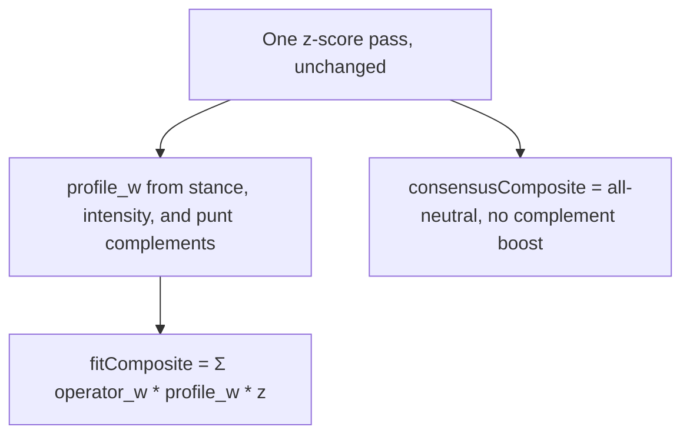

# Punt complement reweight

Plan only. Ranker math, `POST /rank`, and named-build maps stay as they are on this branch. The next PR on this same branch should implement **Approach B**.

## The claim

Z-scores rank players neutrally. When you punt a category, other categories may be worth more.

Two different readings:

1. **The punted cat is worth nothing, so the rest decide the board.** Already true.
2. **The remaining cats are not equal.** Complements of the hole (punt FT% -> FG% / REB / BLK) should outweigh leftover Neutrals (3PM, AST). Only true today if the user marks those complements Need.

Reading 1 is ranking. Reading 2 is build strategy. Custom punt-only does reading 1. Named builds do both.

## What the ranker does today

[`rank()`](app/core/src/ranker.ts) is one z-score pass, then:

```text
composite = Σ operator_w[c] * profile_w[c] * z[c]
profile_w[c] = stanceWeight * (intensity[c] ?? 1)
```

| Stance    | Weight |
| --------- | ------ |
| `need`    | `1.5`  |
| `neutral` | `1`    |
| `punt`    | `0`    |

Punt keeps the cat in `z` and zeroes it in the sum. Disabled cats are omitted from `z` entirely. Need is the only lever that makes a remaining cat worth more than Neutral. Operator JSON is still all `1`.

Named builds already write the classic clusters as Need, not as extra ranker math:

| Build    | Punt | Need                    |
| -------- | ---- | ----------------------- |
| Fortress | FT%  | FG%, REB, BLK, PTS      |
| Bricks   | FG%  | REB, BLK, FT%           |
| Post     | AST  | PTS, REB, BLK, FG%      |
| Sniper   | BLK  | PTS, 3PM, FT%, AST, STL |
| Stocks   | PTS  | STL, BLK                |
| Balanced | —    | all Neutral             |

Custom can punt FT% and leave every other cat Neutral. The ranker then treats the leftover eight as equal.

### Season dump check (2025-26 CSV, floor off)

Consensus vs custom **punt FT% only** vs **Fortress** (Need + punt):

| Player      | Consensus | Punt FT% only | Fortress |
| ----------- | --------- | ------------- | -------- |
| Giannis     | 47        | 5             | 3        |
| Gobert      | 85        | 13            | 10       |
| Curry       | 10        | 27            | 38       |
| Harden      | 18        | 52            | 73       |
| Maxey       | 5         | 6             | 13       |
| Trey Murphy | 15        | 21            | 30       |

Zeroing FT% is enough to lift the players that cat was punishing. Need is what then prefers Duren / Allen / Gobert over Maxey / Murray / Murphy.

Top-24 overlap, punt-FT% only vs Fortress: 21/24. The gap is real and small, and it is exactly the complement cluster.

Uniform 9/8 scale on the leftover weights: **same order** as punt-only. Confirmed on this CSV. Spreading the punted weight evenly cannot be the fix.

Z-correlations on the consensus top 200, for context:

- FT% vs FG% / REB / BLK: about -0.33 / -0.33 / -0.29
- FG% vs 3PM: about -0.61
- AST vs TOV (inverted z): about -0.79

The anti-correlations are in the data. They already move punt-only boards. Extra weight is for tilting leftover Neutrals, not for discovering the cluster.

## Verdict

The ranker **does** reflect “punt makes that cat not count.” It **does not** automatically make complements worth more than other remaining cats. Named builds paper over that with Need 1.5. Custom punt-only does not.

Do not ship a uniform reweight. Do not hide a third weight layer inside `SuggestionHook`. Keep z-scores, operator JSON, and stance weights.

## Approaches

### A. Docs and quiz only

Need stays the complement lever. Scoring copy already says Need 1.5 / Punt 0. Custom that punts without Need gets an honest 8-way Neutral board.

Pros: no rank-order surprise, existing goldens untouched, matches “the quiz sets the weights.”

Cons: a Custom FT% punt still ranks Maxey like a punt-FT% cornerstone. Users who mean “Fortress” and only flip Punt do not get the cluster.

Ship this only if we decide Custom punt-only is a feature.

### B. Static complement boost on leftover Neutrals (recommended)

When at least one enabled cat is Punt, look up complements from a static map (the named-build Need lists, inverted). Remaining cats that are still **Neutral at default intensity** get a modest multiplier (start at **1.25**). Need stays 1.5. Punt stays 0. Fine-tune sliders stay as written.

```text
if punt: 0
else if need: 1.5 * intensity
else if cat is a complement of a punted cat and intensity is default:
    1.25
else: 1 * intensity
```



Source of the map: invert [`NAMED_BUILDS`](app/core/src/named-builds.ts) so we do not maintain two cluster lists. Multi-punt unions the Need lists and drops cats that are themselves punted.

| Punt | Complements             |
| ---- | ----------------------- |
| FT%  | FG%, REB, BLK, PTS      |
| FG%  | REB, BLK, FT%           |
| AST  | PTS, REB, BLK, FG%      |
| BLK  | PTS, 3PM, FT%, AST, STL |
| PTS  | STL, BLK                |

No named build punts TOV, STL, 3PM, or REB. Those punts get no auto-boost until we add a row on purpose.

Flag in [`ranker.json`](app/core/config/ranker.json), same pattern as `availabilityFloor`: `puntComplementBoost` default **true** in the implementation PR after goldens. `RankOptions.puntComplementBoost` overrides in tests. Consensus composite stays all-neutral with no boost so `consensusRank` remains “balanced 9-cat.”

Named builds stay bit-identical: every complement row is already Need 1.5 on that card, so the 1.25 path never fires. Leftover Neutrals on Fortress (3PM, AST, STL, TOV) are not in the FT% row. Custom punt-FT% is the board that changes.

Pros: Custom punt-FT% tilts toward the big-man cluster without forcing Need chips. Named builds keep today’s composites. Inspectable named-build source. No weekly data.

Cons: a Custom user who punts FT% and truly wants leftover cats equal will get a hidden 1.25. Mitigate by boosting only default-Neutral cats, documenting it on Scoring, and keeping the flag.

This is the one to implement.

### C. Correlation-derived weights

Recompute Pearson of z-scores (full universe or top-N) and scale remaining cats by how negatively they correlate with the punted cat.

A probe on this CSV, punt FT%, `intensity = 1.1 - 0.4 * r`:

- Boosted REB / BLK / FG% / inverted TOV (~1.23)
- Cut PTS / 3PM (~0.88)
- Gobert 13 -> 7, Curry 27 -> 52, Harden 52 -> 93

Stronger and noisier than Fortress. TOV sign is easy to get wrong because z is inverted. Weights change when the CSV or min-games filter changes. Hard to explain next to Need 1.5.

Reject for v1. Maybe a later operator experiment, not profile math.

### D. Uniform renormalize

Scale leftover weights so they still sum to nine. Ranking order is identical to today. Reject.

### E. Weekly G-score / H2H leverage

Downweight volatile cats (steals) by week-to-week variance, or weight by category-win probability after a punt. Needs game logs we do not have. Out of scope. Same bucket as VORP / remaining-pool re-z.

### F. Amplify Need when any punt exists

Leave Neutral at 1. If the profile has a punt, raise Need from 1.5 to ~1.8.

Only helps named builds and Custom users who already marked Need. Custom punt-only still treats leftovers equally. Weaker than B for the reported case. Do not do this instead of B.

## What stays

- Z-score formulas, volume-adjusted %, inverted TOV.
- Operator JSON as its own layer.
- Punt = 0, Need = 1.5, intensity 0–2.
- Availability floor off by default. Complement boost is not a substitute for ADP.
- `SuggestionHook` still must not rank.
- Punt vs **omit** may diverge for cats that have a complement row. That is intended: omit means the league does not score it, punt means you are building around the hole. Keep the existing “punt TOV matches omit TOV” golden; TOV has no complement row.

## Implementation (next PR)

Touch core, tests, M2, and Scoring copy. No quiz redesign. Named-build chips stay as they are.

1. **Flag.** `puntComplementBoost` in `ranker.json` plus `RankOptions`. Read it next to `availabilityFloor`.
2. **Map.** One helper: punted enabled cats -> complement set from `NAMED_BUILDS`. Unit-test the invert (FT% -> Fortress Need, BLK -> Sniper Need, FT%+AST union minus those two punts).
3. **`profileWeight`.** Keep the three stance multipliers. Apply 1.25 only when the flag is on, the cat is Neutral, intensity is default, and the cat is in the complement set. Do not stack on Need.
4. **`rank()`.** Fit uses the new weight. Consensus profile stays `stances: {}` and must not take the boost (no punts on that object, so it is free if the helper keys off punts).
5. **Tests.**
    - All-neutral: ranks unchanged vs today.
    - Named Fortress / Bricks / Sniper / Stocks / Post: composites bit-identical to flag false (complements are already Need).
    - Custom punt FT% only: Gobert and Duren-style names rank better than on current punt-only; Maxey / Murphy-style leftover-Neutral names rank worse. Compare against a `puntComplementBoost: false` run, not against Fortress.
    - Boost does not apply when Fine-tune set intensity on that cat.
    - Punt TOV vs omit TOV still matches.
    - Flag false restores today’s composites.
6. **Scoring.** One sentence on `/how-it-works`: a punt can give the usual partners of that hole a small Neutral bump; Need is still higher; Fine-tune still wins.
7. **M2.** Document the third clause of `profile_w`, the flag, and that uniform scale is a no-op. Point at this plan from Remaining ranking gaps.

Constant: put `COMPLEMENT_BOOST = 1.25` next to `STANCE_WEIGHT` in [`profile.ts`](app/core/src/profile.ts). Do not invent a second JSON of weights unless we later want to tune per cat. Named-build invert is enough.

## Suggested order

1. Helper + invert tests (no ranker change).
2. `profileWeight` + flag, goldens that flag-false equals current `main`.
3. Custom punt-FT% vs flag-false golden (Gobert up, Maxey down).
4. Fortress / punt-TOV / all-neutral regression.
5. M2 + Scoring sentence.
6. `npm run format` and core vitest.

## Out of scope

- Correlation-derived or weekly G-score weights.
- Changing Need 1.5 or named-build chips.
- Auto-applying Fortress chips when Custom punts FT%.
- Availability floor, ADP, VORP, remaining-pool re-z.
- UI heat, Need-fit, or why-copy changes beyond Scoring.

## How to verify later

1. Core vitest green. Flag false matches current composites on all-neutral and Fortress fixtures.
2. `POST /rank` Custom `{ ftPct: 'punt' }` with the flag on: Giannis / Gobert ahead of today’s punt-only board; Maxey behind it.
3. Same request with Fortress: composites match today’s Fortress board.
4. 8-cat omit TOV: no complement bump, `z.tov` omitted.
5. Open Scoring and confirm the Neutral-bump sentence. Board chrome can stay as it is.
