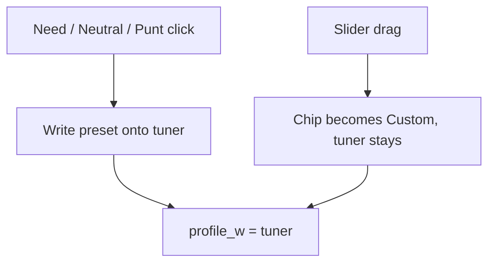

# Punt complement reweight

Plan only. Next pass on this branch should implement **Approach G** with tuner max **0–3** (Need × 2 = 3 is a bar at 3). A later pass adds the [onboarding chart](#onboarding-chart). Stance chips are presets that write the tuner. The slider is the weight. The chart **shows** that vector; **tap the chart for sliders**. **Custom** (home card) opens Need / Neutral / Punt. A drag on a slider off the preset makes that cat’s chip Custom.

## The claim

Z-scores rank players neutrally. When you punt a category, other categories may be worth more.

Two different readings:

1. **The punted cat is worth nothing, so the rest decide the board.** Already true.
2. **The remaining cats are not equal.** Complements of the hole (punt FT% -> FG% / REB / BLK) should outweigh leftover Neutrals (3PM, AST). Only true today if the user marks those complements Need.

Reading 1 is ranking. Reading 2 is build strategy. Custom punt-only does reading 1. Named builds do both.

## What the ranker does today

[`rank()`](app/core/src/ranker.ts) is one z-score pass, then:

```text
composite = Σ operator_w[c] * profile_w[c] * z[c]
profile_w[c] = stanceWeight * (intensity[c] ?? 1)
```

| Stance    | Weight |
| --------- | ------ |
| `need`    | `1.5`  |
| `neutral` | `1`    |
| `punt`    | `0`    |

Punt keeps the cat in `z` and zeroes it in the sum. Disabled cats are omitted from `z` entirely. Need is the only lever that makes a remaining cat worth more than Neutral. Operator JSON is still all `1`. Fine-tune is a second multiplier, not the weight itself. Need + slider 2 = 3.

Named builds already write the classic clusters as Need, not as extra ranker math:

| Build    | Punt | Need                    |
| -------- | ---- | ----------------------- |
| Fortress | FT%  | FG%, REB, BLK, PTS      |
| Bricks   | FG%  | REB, BLK, FT%           |
| Post     | AST  | PTS, REB, BLK, FG%      |
| Sniper   | BLK  | PTS, 3PM, FT%, AST, STL |
| Stocks   | PTS  | STL, BLK                |
| Balanced | —    | all Neutral             |

Custom can punt FT% and leave every other cat Neutral. The ranker then treats the leftover eight as equal.

### Season dump check (2025-26 CSV, floor off)

Consensus vs custom **punt FT% only** vs **Fortress** (Need + punt):

| Player      | Consensus | Punt FT% only | Fortress |
| ----------- | --------- | ------------- | -------- |
| Giannis     | 47        | 5             | 3        |
| Gobert      | 85        | 13            | 10       |
| Curry       | 10        | 27            | 38       |
| Harden      | 18        | 52            | 73       |
| Maxey       | 5         | 6             | 13       |
| Trey Murphy | 15        | 21            | 30       |

Zeroing FT% is enough to lift the players that cat was punishing. Need is what then prefers Duren / Allen / Gobert over Maxey / Murray / Murphy.

Top-24 overlap, punt-FT% only vs Fortress: 21/24. The gap is real and small, and it is exactly the complement cluster.

Uniform 9/8 scale on the leftover weights: **same order** as punt-only. Confirmed on this CSV. Spreading the punted weight evenly cannot be the fix.

Z-correlations on the consensus top 200, for context:

- FT% vs FG% / REB / BLK: about -0.33 / -0.33 / -0.29
- FG% vs 3PM: about -0.61
- AST vs TOV (inverted z): about -0.79

The anti-correlations are in the data. They already move punt-only boards. Extra weight is for tilting leftover Neutrals, not for discovering the cluster.

## Verdict

The ranker **does** reflect “punt makes that cat not count.” It **does not** automatically make complements worth more than other remaining cats. Named builds paper over that with Need 1.5. Custom punt-only does not.

Do not ship a uniform reweight. Do not hide a third weight layer inside `SuggestionHook`. Do not keep stance and the slider as two different numbers. Tuner max is 0–3 so old Need × 2 still exists as a point on that axis. Z-scores and operator JSON stay.

## Approaches

### A. Docs and quiz only

Need stays the complement lever. Custom that punts without Need gets an honest 8-way Neutral board.

Fallback if we refuse any formula or StanceBar change.

### B. Silent 1.25 in the ranker (rejected)

Ranker fill-in of 1.25 on Neutral complements, slider still 1.0, gates so Need chips and Fine-tune stay “true.” Two values, omit-intensity gate, zero-Need gate, Settings one-liner because the controls cannot show the bump.

Overcomplicated. The bump and the tuner disagree. Reject.

### C. Correlation-derived weights

Pearson of z-scores, leftover cats scaled by anti-correlation with the punt. Noisy, TOV sign, season-dependent. Sliders cannot show it. Reject.

### D. Uniform renormalize

Scale leftover weights so they still sum to nine. Ranking order is identical to today. Reject.

### E. Weekly G-score / H2H leverage

Needs game logs we do not have. Out of scope.

### F. Amplify Need when any punt exists

Need ~1.8, Neutral stays 1. Custom punt-only still equal leftovers. Need chip would lie. Reject.

### G. Stance presets write the tuner (recommended)

One number. The slider **is** `profile_w`. Need / Neutral / Punt are presets that set or disable that number. Complement bump is the same path: it writes 1.25 onto the tuner. Dragging off the preset makes that cat **Custom**.

```text
profile_w[c] = tuner[c]          // 0–3

preset(cat) =
  punt     -> 0, slider disabled
  need     -> 1.5
  neutral  -> 1.25 if cat is a complement of an enabled punt, else 1.0
  custom   -> whatever the user dragged (slider enabled, up to 3)

Click Need / Neutral / Punt -> write preset, chip = that stance
Drag tuner off preset       -> chip = custom
Click a stance again        -> reset to that preset
Punt / unpunt another cat   -> rewrite tuners still on Need / Neutral / Punt
                             leave Custom cats alone
```



Complement map: invert [`NAMED_BUILDS`](app/core/src/named-builds.ts), same table as before (FT% -> FG%, REB, BLK, PTS, and so on). Multi-punt unions those lists and drops cats that are themselves punted.

Need still wins over the 1.25 Neutral default: Fortress FG% is Need at 1.5, not Neutral at 1.25. Custom punt-only leaves complements Neutral, so their thumbs move to 1.25.

Per-cat Custom is not the gallery `archetypeId`. Store `stances[cat] = 'custom'`. If any cat is Custom, or the map no longer matches a named card, set `archetypeId` to `custom` so chrome does not keep saying Fortress.

UI: two opens, not one panel.

- **Custom** on Home: Need / Neutral / Punt per cat. Presets write tuners. No sliders on that step.
- **Tap the chart:** sliders only (0–3, Punt locked). Chart never drags. A slider off the current preset marks that cat Custom.

Do not put chips and sliders behind the same tap. Settings on `/draft` can still show both, stacked: chips then sliders, or the same two opens. The [onboarding chart](#onboarding-chart) is the tuner vector.

Always persist `intensity` as the tuner for enabled cats. Drop `includeIntensity`. Ranker reads the tuner. Stance is preset metadata (heat uncolor, Need-fit, why-copy, which cats get rewritten when another punt flips).

Old profiles with no intensity: `tuner = today’s stanceWeight` (Need 1.5, Neutral 1, Punt 0), then apply the Neutral complement default. Old Need × intensity 2 migrates to tuner **3** (Custom, because 3 ≠ Need’s 1.5) and **keeps** that board.

Consensus rank stays all tuners at 1 on the same enabled cats.

#### What this improves

- **One value.** Complement 1.25 and Fine-tune are the same control. FG% reads 1.25, which is the weight.
- **Need × 2 = 3 still exists.** It is the top of the axis, not a hidden multiplier. See [Scale](#scale-0-3-recovers-need--2--3).
- **The bump is visible.** The thumb (and later the bar) moved.
- **No gates.** Mixed Need + punt can still bump leftover Neutrals (1.25) while Need cats sit at 1.5.
- **Override is honest.** Drag FG% to 1.4 or 3 and the chip becomes Custom. Click Neutral to snap back to the current preset.
- **Punt already disables the tuner.** Preset 0, locked.
- **Scoring is one sentence.** The number on the slider is the weight.
- **Ranker math shrinks.** `profile_w[c] = tuner[c]`. Operator JSON still multiplies.
- **`includeIntensity` can die.**

#### What this regresses

- **Schema and goldens move.** `CatStance` gains `custom`. Intensity is always the weight, 0–3. Need is a 1.5 preset on that axis, not a 1.5 multiplier on a 0–2 slider.
- **Fine-tuned named builds become Custom.** Gallery Fortress with no sliders stays Need 1.5 / punt 0 / leftover 1. Intensity 1.2 on Need becomes tuner 1.8 Custom. Intensity 2 on Need becomes tuner 3 Custom (old 3× preserved).
- **Neutral is no longer a constant 1.** After a punt, Neutral complements preset to 1.25. Demoting Fortress FG% Need -> Neutral lands on **1.25**, not 1.0. Drag down for 1.0 (Custom).
- **Clicking a stance wipes a custom tuner.** Need or Neutral is a reset. Today Need -> Neutral keeps intensity 2 (weight 3 -> 2). New: Neutral writes 1 or 1.25.
- **Punt of FT% moves other Neutral thumbs.** Custom cats do not move.
- **Gallery chrome.** One Custom cat flips `archetypeId` to `custom`. Headline drops “Fortress.”
- **Need-fit / why-copy / heat stay chip-based.** Custom 3 and Neutral 1.25 do not count as Need.
- **Phone layout.** Stance bar plus slider (and later a chart) per step is denser.

#### Not regressions (keep)

- Z-score formulas, volume-adjusted %, inverted TOV.
- Punt still in `z`, omitted cats still dropped.
- Operator JSON.
- Availability floor still off.
- `SuggestionHook` still must not rank.
- Punt TOV vs omit TOV: TOV has no complement row.

## Scale: 0–3 recovers Need × 2 = 3

Today’s formula is two layers:

```text
profile_w = stanceWeight * (intensity ?? 1)
Need × slider 2 = 1.5 * 2 = 3
Neutral × slider 2 = 2
Punt = 0
```

Approach G is one axis. Max 2 would make Need stop at 2 and drop the old top. **Max 3** puts that top on the same bar:

| Meaning                        | Tuner |
| ------------------------------ | ----- |
| Punt                           | 0     |
| Neutral                        | 1     |
| Neutral + complement of a punt | 1.25  |
| Need (default)                 | 1.5   |
| Old Need × intensity 2         | 3     |

The onboarding chart’s y-axis is this tuner. Ticks: Punt, Neutral, Need, More. Do **not** store −3..3. Negative need fights Punt = 0 and Neutral = 1 in the ranker. A signed skin (`y = tuner - 1`) puts Neutral at 0 and Punt at −1, which is not “punt to need.” If the chart wants drama, it still plots 0–3.

Neutral can now be dragged to 3 (old Neutral max was 2). Extra headroom. Need default stays 1.5; 3 is opt-in More / Custom.

Zod `intensity` max becomes 3. Slider `max={3}`. Migrate uses 0–3.

## Onboarding chart

Vision: one bar chart on every quiz step. X = enabled cats. Y = tuner 0–3 (punt to need). Each step writes the same G tuners the ranker uses. League last. Extends [quiz-centered-ux.md](quiz-centered-ux.md) without a second weight model.

Today Home is the stance picker; `/onboard` is league then review. Custom skips to chips. There is no Not sure path and no live weight chart.

```text
Home: named build | Custom | Not sure
         |              |         |
      snap preset    chips    questions (2..X)
         |           (N/N/P)      |
         +------+-------+---------+
                |
         live chart (tap → sliders)
                |
            League → Review → /draft
```

### 1. Snap to a named build (questions classify)

Each question is a pair: bigs or guards, 3s or dunks, Jokic or Shai. Answers **vote for named builds**, not raw leftover numbers. Chart can show the current leader. End snap is that card’s G presets.

Bank: many tagged pairs. Session picks 4–6. Seed the shuffle so Back does not reshuffle.

This is the discrete version of Not sure. [Walk then snap](#3-walk-then-snap-not-sure-engine) is the same landing, with motion in between.

### 2. Chart tap = sliders. Custom = chips

Two different opens:

| Press                    | What opens                               |
| ------------------------ | ---------------------------------------- |
| **Custom** on Home       | Need / Neutral / Punt per enabled cat    |
| **The chart** (any path) | Sliders only, 0–3. Punt cats locked at 0 |

The chart is **read-only**. No dragging bars. Sliders are native range inputs in an in-page expand (no quiz drawer). A slider moved off the preset marks that cat Custom. Complement Neutral bars **redraw** at 1.25 when a hole is punted from the chip step.

**Fits G:** chips write presets. Sliders are the same numbers. Chart displays them.

**Improves:** Custom stays the stance editor. Fine-tune stays “I want 1.4 or 3.” Neither control is buried in the other.

Use the chart on every path. Named build and Not sure do not need the slider sheet until they tap the chart. Custom does chips first, then league; they can tap the chart if they want sliders before league.

### 3. Walk then snap (Not sure engine)

Keep the live wiggle. Do **not** save the wiggle.

Each answer steps the preview tuners **toward a named-build vector** (lerp, not ad-hoc `trb + 0.5`). “Bigs” steps toward Fortress/Post. “Guards” steps toward Sniper. The chart moves every tap. Chips during the walk can stay quiet; this preview is not the profile yet.

**Preview vs saved chart.** Walk bars are a sketch. After snap, the same chart component shows the real G presets (solid, same style as named-build and draft). Differentiating the walk (muted fill, dashed outline, “preview” caption) is a **future PR**, not the first chart pass. First chart pass can use one style; do not block ship on a second look. Never rank or persist the sketch.

At the last question, pick the named build whose G preset vector is **closest** (Euclidean on the 0–3 tuners, enabled cats only). Snap the chart to that card: Punt 0, Need 1.5, Neutral 1 or 1.25. Persist **that** `archetypeId` and stance map, not the fingerprint. Copy: `Closest build: Fortress`. Then league → review → `/draft`. Fine-tune is **tap the chart for sliders**. Stance edits are Custom (or Settings chips). That is how they recover “a bit more 3s” without storing a one-off mix from the quiz.

```text
Balanced (all 1)
  → step toward Fortress
  → step toward Sniper
  → … preview mix …
  → nearest named vector
  → snap Fortress  (saved)
  → draft tuners if they want to override
```

**Why not persist the walk:** that is the delta-walk failure mode. After four patches you have 1.3 FG% and 0.4 FT% with Neutral chips, complements cannot run, why-copy and the gallery cannot describe the board. Snapping throws that mix away **on purpose**. The walk is only a classifier with animation. The saved board is always a named preset, same as picking Fortress on Home.

**Why step toward a card, not free deltas:** nearest-neighbor is only honest if the path lives in the same space as the six presets. Random `{ ast: +0.4 }` can finish closer to Balanced than to any story the questions told. Left/right in the bank still name builds. The step is lerp toward that build’s tuner vector. One table, no second weight model.

**Improves vs votes-only:** mixed answers (two bigs, one guard) resolve by geometry, not plurality. The chart feels like a test. End state is still G-clean.

**Regresses vs votes-only:** the end snap can jump. If the preview looked like a hybrid and we stamp Fortress, it reads as bait-and-switch unless the “Closest build” line is loud. Distance ties: gallery order. Fine-tune after does not restore the discarded fingerprint unless we stash it (do not).

**Not sure default:** this walk-then-snap. Votes-only is the same persist with less motion.

### Recommended mix

| Path        | What happens                                         | Chart                              |
| ----------- | ---------------------------------------------------- | ---------------------------------- |
| Named build | Snap G presets. Skip questions.                      | Bars at 0 / 1 / 1.5. Tap → sliders |
| Custom      | Need / Neutral / Punt, then league.                  | Bars follow chips. Tap → sliders   |
| Not sure    | Walk toward named vectors, snap nearest, then draft. | Wiggles, then jumps. Tap → sliders |

League does not write tuners. Review shows the same chart plus pick preview. Board: chips stay a stance editor (Custom / Settings). Chart tap is sliders only.

Keep the bank in data (`id`, `prompt`, `left`, `right`, `toward: NamedBuildId`). Steps lerp toward that card’s G tuner vector. Do not store free-form per-cat deltas. The locked twelve pairs, session picker, and chart chrome live in [onboarding-chart.md](onboarding-chart.md).

### Passes

1. **Weights (this PR).** Approach G, tuner 0–3, Settings sliders = weight. No chart yet.
2. **Chart quiz (follow-up).** [onboarding-chart.md](onboarding-chart.md). Shared `WeightChart` (display only). Tap chart → in-page sliders. Custom home card → Need / Neutral / Punt. Not sure is walk-then-snap with the locked bank. No bar dragging. Walk may share the saved-chart style at first. Design-aesthetic: ink bars, no neon, no pills, Public Sans.
3. **Walk preview chrome (later).** Optional second look so the sketch is obviously not the board (muted/dashed/caption). Same tuners, no new ranker.

Pass 2 only writes `stances` + tuners. Same ranker.

## What stays

- Named-build Need / Punt lists as the complement source.
- Three-segment bar (Need / Neutral / Punt). Custom is empty selection plus a label, not a fourth radio.
- Heat uncolors Punt only.

## Implementation (next PR)

Core + Settings wiring. Chart quiz is pass 2.

1. **Preset helper.** `presetTuner(cat, stances, enabledCats)` from named-build invert. Tests: FT% punt -> FG% 1.25; Fortress Need FG% 1.5; Need wins over complement.
2. **`CatStance` includes `custom`.** Zod intensity 0–3. StanceBar (no segment selected when custom). `quizDraftToProfile` always writes tuners. Punt tuner 0. Drop `includeIntensity`.
3. **`profileWeight`.** `tuner[c]`, default preset if a cat is missing. Consensus uses tuner 1.
4. **UI write path.** Stance click writes preset + chip. Slider `onChange` compares to preset; mismatch -> `custom`. Punt/unpunt re-runs presets on non-custom cats. Any custom cat sets `archetypeId: 'custom'`.
5. **Layout.** Quiz: Custom opens chips. Chart tap opens sliders. Settings may stack both. Remove the Fine-tune expand. Slider `max={3}`.
6. **Migrate.** `tuner = clamp((oldStanceWeight) * (oldIntensity ?? 1), 0, 3)`. If that is not the new preset, stance becomes custom. Old Need × 2 -> tuner 3.
7. **Tests.**
    - All-neutral, no custom: same order as today.
    - Gallery Fortress, no old intensity: same as today.
    - Custom punt FT% only: complement thumbs 1.25; Gobert-style names rise vs today’s punt-only.
    - Drag FG% to 1.4: chip Custom, weight 1.4.
    - Click Neutral: back to 1.25 while FT% is punted.
    - Unpunt FT%: Neutral complements return to 1.0; Custom stays.
    - Old Need × intensity 2 migrates to tuner 3, stance custom.
    - Punt TOV vs omit TOV still matches.
8. **Scoring.** The slider (0–3) is the weight. Presets 0 / 1 / 1.25 / 1.5. 3 is old Need × 2.

## Suggested order

1. Preset helper + invert tests.
2. Schema `custom`, intensity 0–3, `profileWeight` = tuner, migrate helper, core goldens.
3. Custom home card opens chips, not sliders. Chart tap opens sliders, max 3; Fine-tune expand gone.
4. M2 + Scoring.
5. `npm run format` and `npm test`. Browser: Custom punt FT% moves FG% to 1.25; drag to 3 is Custom; Neutral click snaps back; Fortress Need thumbs sit at 1.5.
6. Later PR: [onboarding-chart.md](onboarding-chart.md). WeightChart (tap → in-page sliders), Custom → chips, Not sure walk-then-snap with the locked bank. No drag on bars.
7. Later PR: walk-preview chart style, distinct from the saved board chart.

## Out of scope

- Correlation-derived or weekly G-score weights.
- Persisting a Not sure fingerprint as Custom cats (the walk is preview only).
- Signed −3..3 stored weights.
- Auto-selecting Need when the user punts.
- Availability floor, ADP, VORP, remaining-pool re-z.
- why-copy / Need-fit / heat teaching Neutral-at-1.25 this pass.
- Chart quiz UI (pass 2). See [onboarding-chart.md](onboarding-chart.md).
- Walk-preview visual treatment (pass 3). One chart style is enough until then.

## How to verify later

1. Core vitest green. Gallery Fortress without old intensity matches today’s Fortress order.
2. Custom `{ ftPct: 'punt' }`: FG%/REB/BLK/PTS tuners 1.25. Giannis / Gobert ahead of today’s punt-only; Maxey behind it.
3. Settings: those thumbs read 1.25. Drag REB to 3, chip Custom, weight 3. Neutral click returns 1.25.
4. Unpunt FT%: Neutral complements 1.0. A Custom REB stays 3.
5. Scoring: slider 0–3 is the weight. 3 equals old Need × intensity 2.
6. (Pass 2) Custom: chips. Chart tap: in-page sliders. Not sure: locked bank, wiggle then snap. No dragging bars. Do not rank the unsnapped mix. See [onboarding-chart.md](onboarding-chart.md).
7. (Pass 3) Walk bars read as preview, snapped bars read as the board.
