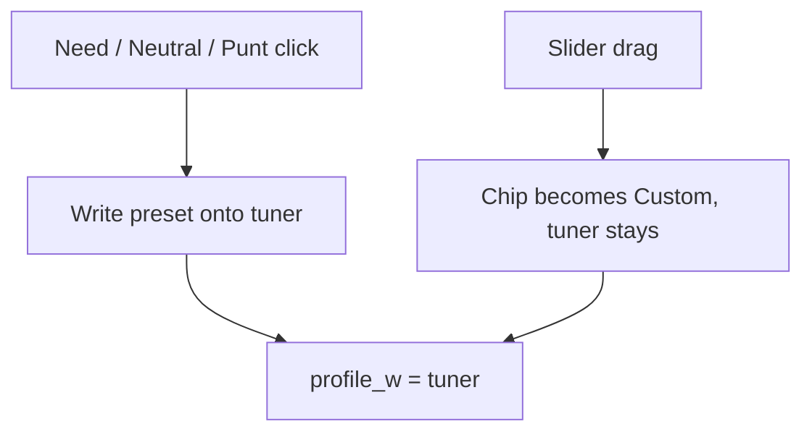

# Punt complement reweight

Plan only. Ranker math, `POST /rank`, and named-build maps stay as they are on this branch. The next PR on this same branch should implement **Approach G**: stance chips are presets that write the tuner. The slider is the weight. A drag off the preset makes that cat Custom.

## The claim

Z-scores rank players neutrally. When you punt a category, other categories may be worth more.

Two different readings:

1. **The punted cat is worth nothing, so the rest decide the board.** Already true.
2. **The remaining cats are not equal.** Complements of the hole (punt FT% -> FG% / REB / BLK) should outweigh leftover Neutrals (3PM, AST). Only true today if the user marks those complements Need.

Reading 1 is ranking. Reading 2 is build strategy. Custom punt-only does reading 1. Named builds do both.

## What the ranker does today

[`rank()`](app/core/src/ranker.ts) is one z-score pass, then:

```text
composite = Σ operator_w[c] * profile_w[c] * z[c]
profile_w[c] = stanceWeight * (intensity[c] ?? 1)
```

| Stance    | Weight |
| --------- | ------ |
| `need`    | `1.5`  |
| `neutral` | `1`    |
| `punt`    | `0`    |

Punt keeps the cat in `z` and zeroes it in the sum. Disabled cats are omitted from `z` entirely. Need is the only lever that makes a remaining cat worth more than Neutral. Operator JSON is still all `1`. Fine-tune is a second multiplier, not the weight itself. Need + slider 2 = 3.

Named builds already write the classic clusters as Need, not as extra ranker math:

| Build    | Punt | Need                    |
| -------- | ---- | ----------------------- |
| Fortress | FT%  | FG%, REB, BLK, PTS      |
| Bricks   | FG%  | REB, BLK, FT%           |
| Post     | AST  | PTS, REB, BLK, FG%      |
| Sniper   | BLK  | PTS, 3PM, FT%, AST, STL |
| Stocks   | PTS  | STL, BLK                |
| Balanced | —    | all Neutral             |

Custom can punt FT% and leave every other cat Neutral. The ranker then treats the leftover eight as equal.

### Season dump check (2025-26 CSV, floor off)

Consensus vs custom **punt FT% only** vs **Fortress** (Need + punt):

| Player      | Consensus | Punt FT% only | Fortress |
| ----------- | --------- | ------------- | -------- |
| Giannis     | 47        | 5             | 3        |
| Gobert      | 85        | 13            | 10       |
| Curry       | 10        | 27            | 38       |
| Harden      | 18        | 52            | 73       |
| Maxey       | 5         | 6             | 13       |
| Trey Murphy | 15        | 21            | 30       |

Zeroing FT% is enough to lift the players that cat was punishing. Need is what then prefers Duren / Allen / Gobert over Maxey / Murray / Murphy.

Top-24 overlap, punt-FT% only vs Fortress: 21/24. The gap is real and small, and it is exactly the complement cluster.

Uniform 9/8 scale on the leftover weights: **same order** as punt-only. Confirmed on this CSV. Spreading the punted weight evenly cannot be the fix.

Z-correlations on the consensus top 200, for context:

- FT% vs FG% / REB / BLK: about -0.33 / -0.33 / -0.29
- FG% vs 3PM: about -0.61
- AST vs TOV (inverted z): about -0.79

The anti-correlations are in the data. They already move punt-only boards. Extra weight is for tilting leftover Neutrals, not for discovering the cluster.

## Verdict

The ranker **does** reflect “punt makes that cat not count.” It **does not** automatically make complements worth more than other remaining cats. Named builds paper over that with Need 1.5. Custom punt-only does not.

Do not ship a uniform reweight. Do not hide a third weight layer inside `SuggestionHook`. Do not keep stance and the slider as two different numbers. Z-scores and operator JSON stay.

## Approaches

### A. Docs and quiz only

Need stays the complement lever. Custom that punts without Need gets an honest 8-way Neutral board.

Fallback if we refuse any formula or StanceBar change.

### B. Silent 1.25 in the ranker (rejected)

Ranker fill-in of 1.25 on Neutral complements, slider still 1.0, gates so Need chips and Fine-tune stay “true.” Two values, omit-intensity gate, zero-Need gate, Settings one-liner because the controls cannot show the bump.

Overcomplicated. The bump and the tuner disagree. Reject.

### C. Correlation-derived weights

Pearson of z-scores, leftover cats scaled by anti-correlation with the punt. Noisy, TOV sign, season-dependent. Sliders cannot show it. Reject.

### D. Uniform renormalize

Scale leftover weights so they still sum to nine. Ranking order is identical to today. Reject.

### E. Weekly G-score / H2H leverage

Needs game logs we do not have. Out of scope.

### F. Amplify Need when any punt exists

Need ~1.8, Neutral stays 1. Custom punt-only still equal leftovers. Need chip would lie. Reject.

### G. Stance presets write the tuner (recommended)

One number. The slider **is** `profile_w`. Need / Neutral / Punt are presets that set or disable that number. Complement bump is the same path: it writes 1.25 onto the tuner. Dragging off the preset makes that cat **Custom**.

```text
profile_w[c] = tuner[c]

preset(cat) =
  punt     -> 0, slider disabled
  need     -> 1.5
  neutral  -> 1.25 if cat is a complement of an enabled punt, else 1.0
  custom   -> whatever the user dragged (slider enabled)

Click Need / Neutral / Punt -> write preset, chip = that stance
Drag tuner off preset       -> chip = custom
Click a stance again        -> reset to that preset
Punt / unpunt another cat   -> rewrite tuners still on Need / Neutral / Punt
                             leave Custom cats alone
```



Complement map: invert [`NAMED_BUILDS`](app/core/src/named-builds.ts), same table as before (FT% -> FG%, REB, BLK, PTS, and so on). Multi-punt unions those lists and drops cats that are themselves punted.

Need still wins over the 1.25 Neutral default: Fortress FG% is Need at 1.5, not Neutral at 1.25. Custom punt-only leaves complements Neutral, so their thumbs move to 1.25.

Per-cat Custom is not the gallery `archetypeId`. Store `stances[cat] = 'custom'`. If any cat is Custom, or the map no longer matches a named card, set `archetypeId` to `custom` so chrome does not keep saying Fortress.

UI: keep the three-segment bar. When the cat is Custom, none of the three is selected; a muted “Custom” label sits by the printed tuner. Do not add a fourth radio. Punt still mutes and disables. Put the slider on the same row as the bar (Settings and Adjust Need and Punt), not a second Fine-tune expand. Named builds show the same row so Need 1.5 and Punt 0 are visible.

Always persist `intensity` as the tuner for enabled cats. Drop `includeIntensity`. Ranker reads the tuner. Stance is preset metadata (heat uncolor, Need-fit, why-copy, which cats get rewritten when another punt flips).

Old profiles with no intensity: `tuner = today’s stanceWeight` (Need 1.5, Neutral 1, Punt 0), then apply the Neutral complement default. Old Need × intensity 2 = 3 clamps to slider max 2. See [Regressions](#what-this-regresses).

Consensus rank stays all tuners at 1 on the same enabled cats.

#### What this improves

- **One value.** Complement 1.25 and Fine-tune are the same control. Expand Fine-tune on a Custom FT% punt and FG% reads 1.25, which is the weight.
- **The bump is visible** without a Scoring footnote as the only tell. The thumb moved.
- **No gates.** Mixed Need + punt can still bump leftover Neutrals (slider 1.25) while Need cats sit at 1.5. The zero-Need and omit-intensity rules go away.
- **Override is honest.** Drag FG% to 1.4 and the chip becomes Custom. Click Neutral to snap back to the current preset (1.25 if FT% is still punted, else 1.0).
- **Punt already disables the tuner.** That behavior stays and now matches the model: preset 0, locked.
- **Scoring is one sentence.** The number on the slider is the weight. Need is a 1.5 preset, Neutral is 1 or 1.25 after a related punt, Punt is 0.
- **Ranker math shrinks.** `profile_w[c] = tuner[c]`. Operator JSON still multiplies. No silent third clause.
- **`includeIntensity` can die.** Today the first thumb move writes 1.0 on every remaining cat. That was the footgun that made B’s “default intensity” fake.

#### What this regresses

- **Need × Fine-tune 2 = 3 is gone.** Today Need is a 1.5 multiplier on a 0–2 slider. New Need is the slider sitting at 1.5; More only goes to 2. Fortress intensity-2 boards get milder (Harden 18 -> 97 today at Need×2; that path cannot reach 3). Keep max 2. Do not raise the cap this pass. Old saved 3× profiles clamp to 2.
- **Schema and goldens move.** `CatStance` gains `custom`. Intensity is always the weight, 0–2. `profileWeight` tests, M2, Scoring, operator-doubling snapshots, and Need×intensity copy all change. This is not a flag-off restore of current composites once named-build users Fine-tuned.
- **Named Fortress default can stay bit-identical; Fine-tuned ones cannot.** Gallery Fortress with no sliders: Need 1.5, punt 0, leftover Neutrals 1. Same as today. A Fortress user who already set intensity 1.2 on Need cats today ranks at 1.8. After migrate-and-clamp they are Custom at min(1.8, 2) or we re-preset to 1.5 and drop the old extra. Prefer migrate `tuner = clamp(stanceWeight * oldIntensity, 0, 2)` and mark Custom if that is not the preset. Their board will not match `main`.
- **Neutral is no longer a constant 1.** After a punt, Neutral complements preset to 1.25. Demoting Fortress FG% Need -> Neutral lands on **1.25**, not 1.0. That is the preset for “I am not Need, but this hole still leans here.” To get 1.0 they drag down and become Custom. Different from today, and different from gated B (which kept 1.0 once any Need existed).
- **Clicking a stance wipes a custom tuner.** Need or Neutral is a reset, not a label on top of a leftover slider. Today changing Need -> Neutral keeps intensity 2, so weight goes 3 -> 2. New: Neutral writes 1 or 1.25. More predictable, but it is a loss of “leave my Fine-tune, only change the multiplier.”
- **Punt of FT% moves other thumbs.** FG% / REB / BLK / PTS jump to 1.25 if they were still Neutral. Honest, and a bigger visual jump than today’s chip-only edit. Custom cats do not move.
- **Gallery chrome.** One Custom cat flips `archetypeId` to `custom`. Headline drops “Fortress.” Correct, but retake will not preselect the Fortress card.
- **Quiz Fine-tune was Custom-only.** Tuners now belong next to every stance row, including named builds. Review gets denser. That is the cost of showing 1.5 / 0 / 1.25. Do not hide the slider on named cards or the bump is invisible again.
- **Need-fit / why-copy / heat stay chip-based.** Custom 1.4 does not count as Need. Neutral 1.25 does not either. Pick-card copy can still miss the complement lean unless we later teach why-copy to mention Neutral-at-1.25. Out of scope for the first pass except Scoring.
- **Phone layout.** Stance bar plus slider per cat is a lot in the Settings sheet. Stack: label, 3-segment bar, slider. Same pattern as today’s IntensityStep, just not nested in Fine-tune.

#### Not regressions (keep)

- Z-score formulas, volume-adjusted %, inverted TOV.
- Punt still in `z`, omitted cats still dropped.
- Operator JSON.
- Availability floor still off. Complement presets are not ADP.
- `SuggestionHook` still must not rank.
- Punt TOV vs omit TOV: TOV has no complement row, so Neutral leftovers stay 1. Existing golden can keep matching if tuners for the other eight stay 1.

## What stays

- Named-build Need / Punt lists as the complement source.
- Slider range 0–2, step 0.1.
- Three-segment bar (Need / Neutral / Punt). Custom is empty selection plus a label, not a fourth radio.
- Heat uncolors Punt only.

## Implementation (next PR)

Core + quiz/Settings wiring. This is a control model change, not a ranker-only flag.

1. **Preset helper.** `presetTuner(cat, stances, enabledCats)` from named-build invert. Tests: FT% punt -> FG% 1.25; Fortress Need FG% 1.5; Need wins over complement; Custom stance ignored (caller does not reset those).
2. **`CatStance` includes `custom`.** Zod, StanceBar (no segment selected), `quizDraftToProfile` always writes tuners for enabled cats. Punt tuner 0. Drop `includeIntensity`.
3. **`profileWeight`.** `tuner[c]`, default preset if a cat is missing (old payloads). Consensus uses tuner 1.
4. **UI write path.** Stance click writes preset + chip. Slider `onChange` compares to preset; mismatch -> `custom`. Punt/unpunt re-runs presets on non-custom cats. Any custom cat or off-map named build sets `archetypeId: 'custom'`.
5. **Layout.** Slider on the stance row in Settings and in Adjust Need and Punt. Remove the Fine-tune expand. Named builds included.
6. **Migrate.** `tuner = clamp((oldStanceWeight) * (oldIntensity ?? 1), 0, 2)`. If that is not the new preset, stance becomes custom.
7. **Tests.**
    - All-neutral, no custom: same order as today.
    - Gallery Fortress, no old intensity: same Need 1.5 / punt 0 / leftover 1 as today.
    - Custom punt FT% only: complement thumbs 1.25; Gobert-style names rise vs today’s punt-only; Maxey-style leftover Neutrals fall.
    - Drag FG% to 1.4: chip Custom, weight 1.4, other Neutral complements stay 1.25.
    - Click Neutral on that FG%: back to 1.25 while FT% is punted.
    - Unpunt FT%: Neutral complements return to 1.0; Custom cats stay put.
    - Old Need × intensity 2 migrates to tuner 2, stance custom.
    - Punt TOV vs omit TOV still matches.
8. **Scoring.** The slider is the weight. Need / Neutral / Punt are presets (0, 1 or 1.25, 1.5). Dragging off a preset is Custom.

## Suggested order

1. Preset helper + invert tests.
2. Schema `custom`, `profileWeight` = tuner, migrate helper, core goldens.
3. StanceBar + slider on one row; Fine-tune expand gone; write-path tests in quiz if they exist, else core-only plus a thin client test.
4. M2 + Scoring.
5. `npm run format` and `npm test`. Browser: Custom punt FT% moves FG% thumb to 1.25; drag makes Custom; Neutral click snaps back; Fortress Need thumbs sit at 1.5.

## Out of scope

- Correlation-derived or weekly G-score weights.
- Raising slider max above 2 to preserve Need×2=3.
- Auto-selecting Need when the user punts (Need stays a 1.5 preset they opt into).
- Availability floor, ADP, VORP, remaining-pool re-z.
- why-copy / Need-fit / heat teaching Neutral-at-1.25 this pass.

## How to verify later

1. Core vitest green. Gallery Fortress without old intensity matches today’s Fortress order.
2. Custom `{ ftPct: 'punt' }`: FG%/REB/BLK/PTS tuners 1.25. Giannis / Gobert ahead of today’s punt-only; Maxey behind it.
3. Settings: those thumbs read 1.25. Drag REB to 1.4, chip Custom, weight 1.4. Neutral click returns 1.25.
4. Unpunt FT%: Neutral complements 1.0. A Custom REB stays 1.4.
5. Scoring says the slider is the weight. No mute line that exists because the slider is lying.
