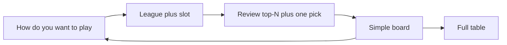
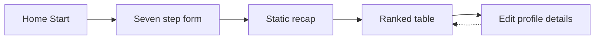
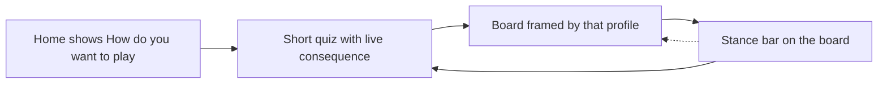
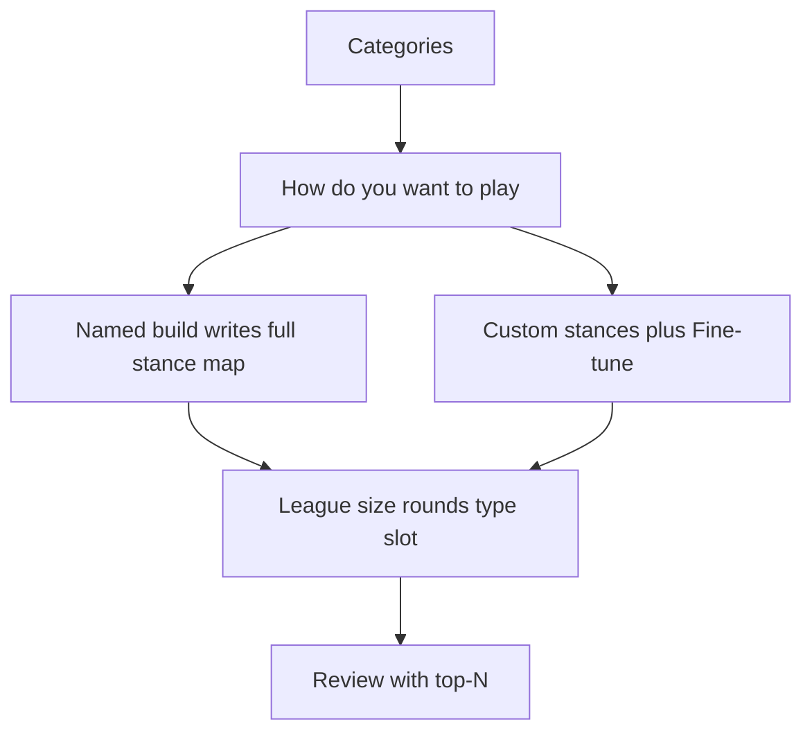

# Quiz-centered UX

High-level approaches for onboarding, the CAT quiz, and the draft board. The goal is to stop competing with ranking sites on table density and instead make the quiz the product.

This is a direction document, not a pixel spec. Implement on the TanStack Start shell from [PR #4](https://github.com/mlmar/waiver-warrior/pull/4), not the Astro island tree on `main`. Ranker math, `POST /rank`, and design-aesthetic locks stay put. No app code until the three passes below.

## Why

Hashtag, Basketball Monster, and FantasyPros already win at "here is a ranked stats table." Waiver Warrior's loop is already different:

```text
quiz → DraftProfile → weighted z-score board → optional round buckets
```

The current UI still markets and presents the table as the app. Home copy on both `main` and PR #4 says the table is the product. The quiz is a seven-step form you complete once, then hide under Edit profile. That makes the site feel like a thinner ranking board with extra settings.

The differentiator should be: you answer CAT questions, the board is the consequence, and you can feel that consequence while you answer.

## What to keep

- No accounts. Profile stays `ww.draftProfile`.
- Ranker math, operator weights, and `POST /rank` stay put.
- Public Sans, light theme, primary `#78A3CF`, no pills, no uppercase kickers. See the design-aesthetic rule.
- v1 still has no taken list, Yahoo, auction, or AI copy.
- Quiz step modules stay data-driven (`STEPS`). Reorder and chrome can change without rewriting each screen.

## Competitive ideas

Keep / adapt / drop so a later implementer does not re-litigate swipe, a fake 94%, or ADP.

**1. Casual CAT selection: take the framing, not the chrome.** See [Named builds](#named-builds).

**2. Modern UI over grids: take simple view + English why, not a fake 94%.**

- Take: quiz landings on a focused "decide at your pick" surface, not 20 z-columns. Two or three Need-cat fit marks. Header language is the profile, not "Ranked players."
- Adapt "Build Match Score": do **not** invent a second ranking or a roster-impact %. Composite already ignores punts (`profileWeight` punt = 0). A useful extra is display-only [Need-fit](#need-fit-and-why-copy).
- Adapt tooltips: a one-line why under the name, from z + stances. Honest examples: "Elite REB, AST, FG% for this build." "Light on 3PM, which you marked Need." "Poor FT% matches your punt."
- Drop: "lowers your FT% by 8%." There is no roster, so that number would be fiction. Do not use an LLM.

**3. Smart draft-slot scenarios: take one name at the pick, not ADP or a tree.**

- Take: ask for `draftSlot` on league basics. Show what pick 7 in a 12-team snake actually is (overall 7, 18, 31, and so on). Simple view should feel like a draft sheet.
- This phase: **one player per pick.** The player at `ranked[overall - 1]` for that round. See [Pick number](#pick-number).
- Later, not this phase: up to 3 names starting at the slot, ADP reaching warnings, if-then trees. See [Later](#later).



## What PR #4 already unlocks

Do not restyle the Astro islands. PR #4 is the substrate this UX needs.

| Unlock                                                 | Why it matters for quiz-centered UX                                                                                                          |
| ------------------------------------------------------ | -------------------------------------------------------------------------------------------------------------------------------------------- |
| Client router                                          | Quiz finish can land on `/draft?assist=1` without a full reload. Returning users can fork Home vs Board vs Retake without `window.location`. |
| `/draft` search                                        | `assist=1` and `values=pm` already live in the URL. Later view flags (`highlight=need`, `view=simple`) fit the same pattern.                 |
| Shared `PageShell` + `SiteNav`                         | Marketing, quiz, and board can share chrome instead of three isolated islands.                                                               |
| Prerendered `/`, `/about`, `/how-it-works`, `/onboard` | First-run copy can sell the quiz before JS. `/draft` stays client-only, which is correct.                                                    |
| Scoring page                                           | Already explains that the quiz only changes weights. Home and About still undercut that by calling the table the product.                    |
| `/onboard?step=`                                       | Step is already in the URL on Start. Back/share during the quiz is free. Do not treat per-step routes as future work.                        |

PR #4 does **not** change quiz steps, `ChoiceRow`, review, or table chrome. Those are the UX problem.

## Current gaps

### Home to quiz

- Home is a title plus Start. It does not show a CAT question, a sample named build, or why answering beats opening a generic board.
- Returning users with a saved profile still start at step 1 of `/onboard`. Jump to review exists only after the quiz mounts.
- PR #4 adds Scoring and About, but both still CTA into the quiz without a "you already have a board" path.

### Quiz

- Seven screens before any ranking. League size and draft type are settings. Stances and the stocks/points pair are the actual quiz, and they sit in the middle and near the end.
- Review is a static recap. M3 originally wanted a top-10 preview so the user saw the quiz matter. That preview was dropped when ranking moved to `/draft`.
- Optional intensity is eight native range inputs. Fine for power users, cold for a first run.
- The archetype pair is one of two personality moments and it comes after intensity. `applyArchetypeNudge` only marks one or two cats Need and leaves existing punts. It cannot skip stances.
- Mid-quiz answers are not saved. Refresh restores the last completed profile, or defaults.
- Feedback is chips and a progress bar. Nothing shows names moving.

### Draft board

- The ranked table is the whole page. Quiz answers live in a `<details>` dump of the same step components.
- Heat is league z, not "fits your profile." `teamNeed` is already sketched in `cat-highlight.ts` and called out in the heatmap change note. Until that ships, the board looks like every other heat table.
- Assistance is a toggle. PR #4 already turns it on after the quiz (`?assist=1`). The chrome still treats it as an optional view of a generic list.
- Known table issues stay: sticky rank/name vs horizontal scroll on phones, no search, dense shadcn chrome. PR #4's own next step was to revisit density on the Start shell.



Target loop:



## Positioning

Rewrite the story in this order: quiz, then board as output.

1. **Home:** "Tell us how you want to play. We rank the 2025-26 board for that profile." Tease the gallery, not stance chips. Static example of two cards (Fortress, Sniper) plus Start. Start is still the primary CTA. If `ww.draftProfile` exists after hydrate, offer Open board and Retake quiz.
2. **About / Scoring:** Keep the math page. Change "the table is the product" to "the quiz sets the weights, the table is the result." Scoring already has the right explanation.
3. **Nav:** After a profile exists, Board belongs in chrome. Quiz stays reachable as Retake or Edit build, not only as first-run onboarding.

Do this copy pass first. It is cheap on the PR #4 routes and it stops the product from arguing with itself.

## Onboarding and quiz approaches

Pick a mix. Do not do all of them in one pass.

### 1. Lead with How do you want to play

Move league size, rounds, and snake/linear later, onto one "League basics" screen. Categories stay first so the gallery can hide builds that punt a disabled cat.

Recommended order. Named path is four screens. Custom adds one.

1. Categories (9-cat / 8-cat / custom)
2. How do you want to play (named build skips stances)
3. Stances only on Custom, with Fine-tune disclosure
4. League basics (size, rounds, type, **pick slot**)
5. Review that is a board preview, not a recap list

Settings still belong on the profile. They should not be the first three taps. A named build is how most people skip the form. Custom is how they tune. See [Named builds](#named-builds).

### 2. Show consequence while they answer

This is the main differentiator. After stances (or on review), `POST /rank` with the in-progress draft and show a compact top 8 to 10, plus two or three names that moved when the last chip changed.

Keep it small. Do not mount the full draft table inside `/onboard`. A short list plus "FG% punt lifted these bigs" is enough. Rank failure stays on the step, same as today's review error path.

PR #4 makes this easier: the quiz is already a client tree talking to Fastify. No island remount.

### 3. Collapse first-run length

- Merge league + draft type + slot.
- Make review the first sight of the board, then Continue to `/draft?assist=1`.
- Hide intensity behind Fine-tune on the Custom stances screen. No separate intensity step.
- Replace the one stocks/points pair with the named-build gallery. See [Named builds](#named-builds).

### 4. Treat returning users as a different entry

If a valid profile hydrates:

- Home: Open board (to `/draft?assist=1`) plus Retake.
- `/onboard`: keep Jump to review, and add a one-line summary of the saved build so it does not feel like a blank form (`Fortress · punt FT%`).

In-progress answers still do not need a second persist key in the first UX pass. Completed profile restore is enough.

## Named builds

Today the quiz is seven screens and the personality moment is last: a Stocks vs Points `ChoiceRow` that only nudges one or two cats to Need. Replace that with a gallery that _is_ the CAT quiz.

Take: "How do you want to play?" Named builds write a **full** stance map and skip stances + intensity. Custom still asks Need / Neutral / Punt.

Adapt: one-word title plus a CAT helper line. Tap to select, then Continue (same shell as every other step). Use stacked described buttons or the unused `card.tsx`. Intensity sliders live behind Fine-tune on Custom only.

Drop: Tinder swipe, emoji, gaming loadout chrome, nine sliders on first run. Matches the design-aesthetic rule and current out-of-scope.

### Screens

1. **Categories.** Unchanged job: 9-cat / 8-cat / custom toggles. Not "select your target CATs."
2. **How do you want to play?** Gallery. Continue disabled until one card is selected.
3. **Stances, Custom only.** One Need / Neutral / Punt row per enabled cat. Fine-tune is a closed `<details>` on this same screen with the 0–2 sliders. No separate intensity step. `includeIntensity` is true only if they open Fine-tune and change a slider.
4. **League basics.** Size, rounds, snake/linear, **pick slot** on one screen.
5. **Review.** Board preview (top-N), not a recap `<dl>`. "Edit stances" is always available so a named-build user can tweak without retaking.



`STEPS` stays data-driven. `handleContinue` on the gallery step writes the map, then skips `stances` when `archetypeId` is not `custom`. Back from league on a named build returns to the gallery, not to a hidden stances screen.

### What a named build writes

Replace `applyArchetypeNudge` (leave existing punts, mark one or two Need) with `applyArchetype(draft, id)` that overwrites stances for every **enabled** cat. Need = 1.5, omitted = Neutral, punt = 0. Do not write `intensity`. Set `includeIntensity: false`. Switching cards overwrites. Going Back and picking a different card overwrites.

Custom is not a seventh map. It sets `archetypeId: 'custom'` and resets enabled cats to Neutral (blank form). "I almost wanted Fortress" is Edit stances on review, or the board stance bar later.

Persist optional `archetypeId` on `DraftProfile` (`balanced` | `puntFg` | `puntFt` | `guards` | `stocks` | `puntAst` | `custom`). Old profiles omit it. Do not infer from chips. Board chrome and retake preselect use this id. Put the maps in one module (quiz or core) so labels do not drift.

### Gallery copy

Prompt: **How do you want to play?** No emoji. No uppercase kickers. Each named card is a **one-word title** plus the CAT helper on one muted line. No pitch sentence on the card. Custom is the word **Custom** with no helper map.

Custom sits last, quieter (text button or outline card under the named list), not in the same even grid. Named cards stack on a phone. `md:` can be two columns. Tight grouping, not seven identical padded tiles.

| Id         | Label    | Need                    | Punt |
| ---------- | -------- | ----------------------- | ---- |
| `balanced` | Balanced | all Neutral             | none |
| `puntFg`   | Bricks   | REB, BLK, FT%           | FG%  |
| `puntFt`   | Fortress | FG%, REB, BLK, PTS      | FT%  |
| `guards`   | Sniper   | PTS, 3PM, FT%, AST, STL | BLK  |
| `stocks`   | Stocks   | STL, BLK                | PTS  |
| `puntAst`  | Post     | PTS, REB, BLK, FG%      | AST  |
| `custom`   | Custom   | ask                     | ask  |

Helper line examples: `Need FG%, REB, BLK, PTS · Punt FT%`. Balanced: `All cats Neutral`. Sniper keeps REB Neutral so it is not a double punt. Stocks does not also punt FG%. Ids stay as above. Labels in chrome, retake, and Home use the one-word title.

### 8-cat and custom cats

8-cat drops TOV from every map. None of the named builds punt TOV, so all six still show.

Custom cats: hide a named card if its **punt** cat is not enabled (a punt of nothing is a nonsense card). Hide if **none** of its Need cats are enabled. When applying, write Need/Punt only on enabled keys. Every other enabled cat is Neutral.

### Home and restore

Home first-run: tease this question, not stance chips. Static example of two cards (Fortress, Sniper) plus Start. If `ww.draftProfile` hydrates: Open board and Retake.

Retake: gallery preselects saved `archetypeId`. Jump to review stays. One-line summary can be the one-word label (`Fortress · punt FT%`).

After a named build, board chrome says the one-word label, not a dump of chips. Stance bar still lets them change a cat. Simpler v1: leave `archetypeId` as the last gallery choice. The stance bar is the live truth.

### What this replaces

Drop the Stocks vs Points step. `stocks` in the table above is that idea with a real punt, so it can skip the rest. Balanced is the three-tap board (cats, balanced, league) plus review.

Do not add a second gallery later. No swipe. If the build is wrong, change it on the board stance bar or Retake.

## Need-fit and why-copy

Display only. Ranker math does not change. Do not re-sort by Need-fit. Do not call it "Score Match."

Need-fit is a squash of this player's Need-cat z-scores, not a roster impact number. Composite already ignores punts.

- If the profile has Need cats: `raw = mean(z[c] for Need cats)`, then `fit = clamp(round(50 + 25 * raw), 0, 100)` so about +2z Need average reads 100, 0z reads 50, −2z reads 0.
- If Balanced (no Need cats): hide the number. Rank _is_ the score.
- Label it "Need-cat fit."

Why-copy is a one-line under the name, from `RankedPlayer.z` + stances. Client helper. `SuggestionHook.annotate` may later set `notes`. Do not use an LLM in v1. Native `title=` can stay for heat cells. A shadcn tooltip is optional, not required.

Allowed:

- "Elite REB, AST, FG% for this build."
- "Light on 3PM, which you marked Need."
- "Poor FT% matches your punt."

Banned:

- "Lowers your FT% by 8%." There is no roster, so that number would be fiction.
- Any sentence that pretends adding this player moves team category averages.

## Draft board approaches

The board should read as "this list exists because of your quiz," not "here is a spreadsheet, settings are in the drawer."

### 1. Put the profile in the chrome

Replace the Edit profile `<details>` dump as the only place answers live.

Always-visible, compact:

- Build + league: `Fortress · 12-team snake · pick 7`
- Stance row: one control per enabled cat (Need / Neutral / Punt). Changing a chip persists and re-ranks, same as today.
- Intensity and custom cats stay behind a secondary Edit.

Tapping a stance **is** retaking a slice of the quiz without leaving the board. That is how the product stays quiz-centered after first run.

### 2. Color by the profile, not only league z

Ship the planned `teamNeed` highlight strategy. Point the board at it (or add `?highlight=need` next to `assist` and `values`).

League z answers "is this player good at points." Team need answers "does this player fit the build you just described." The second question is the one ranking sites do not ask.

Keep the existing ramp, tokens, and raw/+/- text. Do not invent a second color system.

### 3. Frame assistance as the quiz output

After onboard, `/draft?assist=1` is already the handoff. Lean into it:

- Header: "Ranked for your CAT profile" rather than "Ranked players."
- Round labels can stay `Round k`. A one-line caption under the header is enough: same list, sliced into league-size buckets, last round is the tail.
- Do not persist the toggle. URL is the persist, per PR #4.

### 4. Density and mobile, on the Start shell

PR #4 already called this out. Do it as a board pass, not a rewrite:

- Tighter table chrome. Composite under the name can stay. Identity columns should not dominate a phone.
- Fix or accept the sticky rank/name vs `overflow-x` fight. A usable horizontal scan matters more than a perfect thead stick.
- Search-by-name is useful and still not "become a stats site." Column sort stays out unless there is a strong reason. Rank order is the quiz result.

### 5. Leave taken/my pick alone

Mark taken would make this a draft room. That is a different product. v1 is a personal ranking from a quiz. Do not smuggle session tracking into a UX polish pass.

A **draft slot** (pick 7 of 12) is not a taken list. It is a highlight on this same BPA board. See [Pick number](#pick-number).

## Pick number

Ask for slot on the league-basics screen: pick `1 .. leagueSize`. Persist it on `DraftProfile` as `draftSlot`. It belongs with league size and snake/linear, not in `/draft` search.

Snake vs linear still does not change `partitionByRound`. Slot only changes **which name in each round is yours**, if everyone took BPA off this list.

Overall pick for round `r`, slot `s`, size `n`:

- Linear: `(r - 1) * n + s`
- Snake, odd `r`: same as linear
- Snake, even `r`: `r * n - s + 1`

Pick 7 in a 12-team snake: overall 7, 18, 31, 42, and so on. The player at `ranked[overall - 1]` is "your pick" in that round. Ranker math does not change. Slot does not feed `POST /rank`.

### This phase: one player per pick

Simple view after quiz (`?assist=1&view=simple`): one pick card per round. The player at `ranked[overall - 1]`. Card chrome: name, pos, pick number, 2-3 fit marks, one why-line. Weak Need cat as muted copy, not a saturated warning banner. No uppercase "PICK SUGGESTION" kicker.

Caption: "If the room drafted this board in order, this is the name at your pick."

No slot: show the first name in that round. Do not include names before the slot, and do not show the next two on the board. One target, not a window.

The card is a small header widget, not a second table kit. Keep one `PlayerTable` only if the user opens the full table.

**Your-team strip** stays optional and separate: the 13 (or `draftRounds`) names at those overall picks. Caption: "BPA at your slots." One path, not branches. Best pair with simple view once the one-pick card ships.

On the detailed grid, still mark the slot row (`Your pick · 7th`) with a quiet left rule or row fill. In assistance chrome, say `Pick 18` on the row that is your round-2 turn. Flat-table mode can keep Rank.

### What not to do with slot

- Do not grey out names above your pick as "likely gone" unless you are explicit that "gone" means "higher on _your_ board." That is circular, but it is honest. Fake ADP is worse.
- Do not re-z-score for early vs late. Slot is a lens, not a weight.
- Do not auto-pick for other teams. No CPU, no ADP opponent model. M4 stays.
- Do not show an if-then tree ("If you took A, target X"). That needs a taken list and an opponent model. Without that, Round 2 is just overall pick 18 on the same list.
- Do not say "ADP is 45, don't waste Pick 18." CSV has no ADP. Using this board's rank 45 as "reach at pick 18" is circular.

If `draftSlot` is missing (old profiles), treat assistance as today's unlabeled buckets. Do not invent pick 1.

## Detailed vs simplified board

Today's table is one density: identity, every enabled cat, heat, composite under the name, optional round groups. Add a view flag next to the existing ones: `/draft?assist=1&view=simple`. Missing `view` is the detailed table.

The toggle is not raw vs +/-. Those stay a text mode on the detailed grid. Simple vs detailed is **what the page is for**.

**Simple = decide at your pick.** **Detailed = research the universe.**

### Simplified view shows

- Header: profile one-liner (`Fortress · 12-team snake · pick 7`).
- Stance chips (read or tap). No intensity sliders.
- If assistance is on: one pick card per round (BPA at the slot). No ±2 window. No 3-name list in this phase.
- Without a slot: the first name in that round.
- On the card: pick number, name, pos. No team column. Two or three **fit marks** from the quiz. Examples: `STL +1.4`, `BLK +0.9`, `FG% ignored`. Use the same signed score as +/-. Need cats first. Punted cats as muted "ignored," not a red cell. One why-line. Need-fit only if the profile has Need cats.
- Optional your-team strip above the rounds.
- No full cat grid, no heat legend, no Edit profile dump. A "Full table" control is enough.

Landing from the quiz (`?assist=1`) can default to simple so the first board feels like a draft sheet, not a spreadsheet.

### Detailed view shows

- What ships today, plus the stance bar from [Put the profile in the chrome](#1-put-the-profile-in-the-chrome).
- All enabled-cat columns, league-z or `teamNeed` heat, raw vs +/-.
- Full round buckets (league-size rows) when assistance is on. Your-pick row still marked if `draftSlot` is set.
- Search-by-name. Composite under the name.
- Intensity and custom cats behind Edit.

### How they relate

|         | Simplified                     | Detailed                   |
| ------- | ------------------------------ | -------------------------- |
| Job     | Who is on the clock at my pick | Why this order, every cat  |
| Rows    | One pick card per round        | Full universe / full round |
| Cats    | 2-3 fit marks + why-line       | Every enabled cat + heat   |
| Slot    | Primary                        | Marker on a full grid      |
| Default | After onboard, and on a phone  | Assist off, or user toggle |

Keep one `PlayerTable`. Simple is fewer columns and fewer rows plus the pick card, not a second widget kit. URL owns the flag, same as `assist` and `values`.

## Later

Parked. Not in the three v1 passes.

- **Up to 3 names at the slot.** BPA at `ranked[overall - 1]`, then the next two on this board. Same card chrome. Fewer than 3 only at the tail. No names before the slot.
- **ADP reaching warnings.** Needs an ADP data source. Still no CPU mock. Do not fake ADP from this board's ranks.
- **If-then trees** ("If you took A, target X") only after a taken list exists.

## Recommended sequence

Work against the PR #4 branch (or `main` after it merges). Three thin passes beat one redesign.

1. **Story and entry.** Home / About / Scoring copy. Tease How do you want to play (Fortress, Sniper). Returning-user fork. Board in nav when a profile exists. Header language on `/draft`.
2. **Quiz payoff.** Categories, then How do you want to play. Named builds skip stances. Custom is one stances screen with Fine-tune disclosure. Merged league + slot. Review top-N. Store `draftSlot` + `archetypeId`. Replace `applyArchetypeNudge` with a full map write.
3. **Board as quiz output.** Stance bar. `view=simple` with one pick card per round. Why-line + Need-fit display helper. `teamNeed` heat on the detailed grid. Optional your-team strip.

Pass 1 is copy and routing. Pass 2 is `/onboard` plus a small schema add (`draftSlot`, `archetypeId`). Pass 3 is `/draft` plus highlight. Ranker formulas stay untouched throughout. Slot does not feed `POST /rank`.

Pass 3 is where the card vs spreadsheet contrast actually ships. Pass 2 is where the quiz stops feeling like an Excel sheet.

## Out of scope for this direction

- Accounts, Yahoo, live NBA fetch, auction.
- CPU opponents, ADP, replacement-level, positional scarcity.
- Mark taken / pick-by-pick session. Slot highlight is not that.
- Per-question routes, Tinder for every screen, a second named-build gallery, swipe stacks.
- Match-% as a second sort key. Roster-impact sentences.
- A 3-name list at the slot, in the three passes. See [Later](#later).
- Column sort, dark mode, second typeface, saturated gradients.
- Prerendering `/draft`.
- AI writeups, tooltip package, swipe deps, ADP CSV.

## How to judge it

A stranger should be able to say what this site is after the home screen: a CAT quiz that ranks a board, not a stats dump with a settings form.

Checks:

1. First run: categories then How do you want to play. A named build skips stances. Custom is one extra screen with Fine-tune closed. Review shows names. Finish lands on `/draft?assist=1` (simple view is allowed).
2. Returning run: Home offers the board without retaking seven steps. Stances are visible on `/draft` without opening Edit profile. Chrome can say `Fortress`.
3. Changing Need / Punt on the board moves order and, once `teamNeed` ships, heat. Refresh keeps the profile. Assist, +/-, and view still follow the URL. Slot stays on the profile.
4. Pick 7 in a 12-team snake shows one name at overall 7, then 18, then 31, not "rank 7 in every round" and not a 3-name window.
5. Scoring/About still explain math. They no longer say the table is the product.
6. Phone: simple view is usable without horizontal cat scroll. Detailed still scrolls cats.
7. Need-fit is hidden on Balanced. Why-line is present on the pick card. No emoji, no swipe, no roster-% sentence, no ADP.

## Reference

- [M3-onboarding.md](../M3-onboarding.md)
- [M4-draft-assistant.md](../M4-draft-assistant.md)
- [M5-extensibility.md](../M5-extensibility.md)
- [2026-09-16-onboarding-quiz.md](../changes/2026-09-16-onboarding-quiz.md)
- [2026-09-20-draft-board-heatmap.md](../changes/2026-09-20-draft-board-heatmap.md)
- PR #4 change note (on that branch): `docs/changes/2026-09-21-tanstack-start.md`
