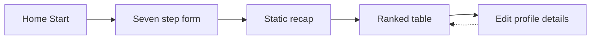
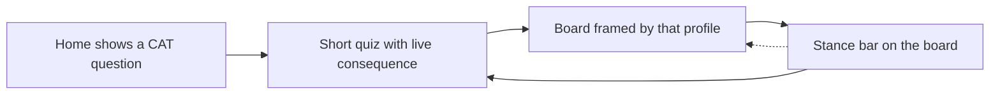

# Quiz-centered UX

High-level approaches for onboarding, the CAT quiz, and the draft board. The goal is to stop competing with ranking sites on table density and instead make the quiz the product.

This is a direction document, not a pixel spec. Implement on the TanStack Start shell from [PR #4](https://github.com/mlmar/waiver-warrior/pull/4), not the Astro island tree on `main`.

## Why

Hashtag, Basketball Monster, and FantasyPros already win at "here is a ranked stats table." Waiver Warrior's loop is already different:

```text
quiz → DraftProfile → weighted z-score board → optional round buckets
```

The current UI still markets and presents the table as the app. Home copy on both `main` and PR #4 says the table is the product. The quiz is a seven-step form you complete once, then hide under Edit profile. That makes the site feel like a thinner ranking board with extra settings.

The differentiator should be: you answer CAT questions, the board is the consequence, and you can feel that consequence while you answer.

## What to keep

- No accounts. Profile stays `ww.draftProfile`.
- Ranker math, operator weights, and `POST /rank` stay put.
- Public Sans, light theme, primary `#78A3CF`, no pills, no uppercase kickers. See the design-aesthetic rule.
- v1 still has no taken list, Yahoo, auction, or AI copy.
- Quiz step modules stay data-driven (`STEPS`). Reorder and chrome can change without rewriting each screen.

## What PR #4 already unlocks

Do not restyle the Astro islands. PR #4 is the substrate this UX needs.

| Unlock | Why it matters for quiz-centered UX |
| --- | --- |
| Client router | Quiz finish can land on `/draft?assist=1` without a full reload. Returning users can fork Home vs Board vs Retake without `window.location`. |
| `/draft` search | `assist=1` and `values=pm` already live in the URL. Later view flags (`highlight=need`) fit the same pattern. |
| Shared `PageShell` + `SiteNav` | Marketing, quiz, and board can share chrome instead of three isolated islands. |
| Prerendered `/`, `/about`, `/how-it-works`, `/onboard` | First-run copy can sell the quiz before JS. `/draft` stays client-only, which is correct. |
| Scoring page | Already explains that the quiz only changes weights. Home and About still undercut that by calling the table the product. |

PR #4 does **not** change quiz steps, `ChoiceRow`, review, or table chrome. Those are the UX problem.

## Current gaps

### Home to quiz

- Home is a title plus Start. It does not show a CAT question, a sample stance, or why answering beats opening a generic board.
- Returning users with a saved profile still start at step 1 of `/onboard`. Jump to review exists only after the quiz mounts.
- PR #4 adds Scoring and About, but both still CTA into the quiz without a "you already have a board" path.

### Quiz

- Seven screens before any ranking. League size and draft type are settings. Stances and the stocks/points pair are the actual quiz, and they sit in the middle and near the end.
- Review is a static recap. M3 originally wanted a top-10 preview so the user saw the quiz matter. That preview was dropped when ranking moved to `/draft`.
- Optional intensity is eight native range inputs. Fine for power users, cold for a first run.
- The archetype pair is one of two personality moments and it comes after intensity. Existing punts stay, which is correct, but the screen feels like an afterthought.
- Mid-quiz answers are not saved. Refresh restores the last completed profile, or defaults.
- Feedback is chips and a progress bar. Nothing shows names moving.

### Draft board

- The ranked table is the whole page. Quiz answers live in a `<details>` dump of the same step components.
- Heat is league z, not "fits your profile." `teamNeed` is already sketched in `cat-highlight.ts` and called out in the heatmap change note. Until that ships, the board looks like every other heat table.
- Assistance is a toggle. PR #4 already turns it on after the quiz (`?assist=1`). The chrome still treats it as an optional view of a generic list.
- Known table issues stay: sticky rank/name vs horizontal scroll on phones, no search, dense shadcn chrome. PR #4's own next step was to revisit density on the Start shell.



Target loop:



## Positioning

Rewrite the story in this order: quiz, then board as output.

1. **Home:** "Tell us what you need and punt. We rank the 2025-26 board for that profile." Show one sample question (Need / Neutral / Punt on a cat, or Stocks vs Points). Start is still the primary CTA. If `ww.draftProfile` exists after hydrate, offer Open board and Retake quiz.
2. **About / Scoring:** Keep the math page. Change "the table is the product" to "the quiz sets the weights, the table is the result." Scoring already has the right explanation.
3. **Nav:** After a profile exists, Board belongs in chrome. Quiz stays reachable as Retake or Edit build, not only as first-run onboarding.

Do this copy pass first. It is cheap on the PR #4 routes and it stops the product from arguing with itself.

## Onboarding and quiz approaches

Pick a mix. Do not do all of them in one pass.

### 1. Lead with the CAT questions

Move league size, rounds, and snake/linear later, or onto one "League basics" screen.

Recommended order:

1. Categories (9-cat / 8-cat / custom)
2. Build (stocks vs points, still skippable)
3. Stances (Need / Neutral / Punt)
4. Intensity (optional, skippable)
5. League basics (size, rounds, type)
6. Review that is a board preview, not a recap list

Settings still belong on the profile. They should not be the first three taps. The unique answers should come while attention is high.

### 2. Show consequence while they answer

This is the main differentiator. After stances (or on review), `POST /rank` with the in-progress draft and show a compact top 8 to 10, plus two or three names that moved when the last chip changed.

Keep it small. Do not mount the full draft table inside `/onboard`. A short list plus "FG% punt lifted these bigs" is enough. Rank failure stays on the step, same as today's review error path.

PR #4 makes this easier: the quiz is already a client tree talking to Fastify. No island remount.

### 3. Collapse first-run length

- Merge league + draft type.
- Make review the first sight of the board, then Continue to `/draft?assist=1`.
- Keep intensity skippable. Consider hiding the sliders behind "Fine-tune" so Skip is the visual default.
- One optional archetype is still the v1 lock. Do not add more swipe pairs. Do make that pair larger and earlier.

### 4. Treat returning users as a different entry

If a valid profile hydrates:

- Home: Open board (to `/draft?assist=1`) plus Retake.
- `/onboard`: keep Jump to review, and add a one-line summary of the saved stances so it does not feel like a blank form.

In-progress answers still do not need a second persist key in the first UX pass. Completed profile restore is enough.

### 5. Optional later: step in the URL

`/onboard?step=stances` is natural on Start and awkward on Astro islands. Only worth it if Back/share during the quiz becomes a real complaint. Not in the first pass.

## Draft board approaches

The board should read as "this list exists because of your quiz," not "here is a spreadsheet, settings are in the drawer."

### 1. Put the profile in the chrome

Replace the Edit profile `<details>` dump as the only place answers live.

Always-visible, compact:

- League chip: `12-team snake · 13 rounds`
- Stance row: one control per enabled cat (Need / Neutral / Punt). Changing a chip persists and re-ranks, same as today.
- Intensity and custom cats stay behind a secondary Edit.

Tapping a stance **is** retaking a slice of the quiz without leaving the board. That is how the product stays quiz-centered after first run.

### 2. Color by the profile, not only league z

Ship the planned `teamNeed` highlight strategy. Point the board at it (or add `?highlight=need` next to `assist` and `values`).

League z answers "is this player good at points." Team need answers "does this player fit the build you just described." The second question is the one ranking sites do not ask.

Keep the existing ramp, tokens, and raw/+/- text. Do not invent a second color system.

### 3. Frame assistance as the quiz output

After onboard, `/draft?assist=1` is already the handoff. Lean into it:

- Header: "Ranked for your CAT profile" rather than "Ranked players."
- Round labels can stay `Round k`. A one-line caption under the header is enough: same list, sliced into league-size buckets, last round is the tail.
- Do not persist the toggle. URL is the persist, per PR #4.

### 4. Density and mobile, on the Start shell

PR #4 already called this out. Do it as a board pass, not a rewrite:

- Tighter table chrome. Composite under the name can stay. Identity columns should not dominate a phone.
- Fix or accept the sticky rank/name vs `overflow-x` fight. A usable horizontal scan matters more than a perfect thead stick.
- Search-by-name is useful and still not "become a stats site." Column sort stays out unless there is a strong reason. Rank order is the quiz result.

### 5. Leave taken/my pick alone

Mark taken would make this a draft room. That is a different product. v1 is a personal ranking from a quiz. Do not smuggle session tracking into a UX polish pass.

## Recommended sequence

Work against the PR #4 branch (or `main` after it merges). Three thin passes beat one redesign.

1. **Story and entry.** Home / About / Scoring copy. Returning-user fork. Board in nav when a profile exists. Header language on `/draft`.
2. **Quiz payoff.** Reorder `STEPS` toward CAT-first. Compact league screen. Live top-N (or movers) on review. Intensity visually skippable.
3. **Board as quiz output.** Stance bar in chrome. `teamNeed` heat. Density/mobile pass on `PlayerTable`.

Pass 1 is copy and routing. Pass 2 is `/onboard` plus a small rank preview. Pass 3 is `/draft` plus `app/core` highlight. Ranker formulas stay untouched throughout.

## Out of scope for this direction

- Accounts, Yahoo, live NBA fetch, auction.
- CPU opponents, ADP, replacement-level, positional scarcity.
- Per-question routes, extra archetype pairs, Tinder for every screen.
- Column sort, dark mode, second typeface, saturated gradients.
- Prerendering `/draft`.

## How to judge it

A stranger should be able to say what this site is after the home screen: a CAT quiz that ranks a board, not a stats dump with a settings form.

Checks:

1. First run: a CAT question appears before league size. Review shows names, not only a recap list. Finish still lands on `/draft?assist=1`.
2. Returning run: Home offers the board without retaking seven steps. Stances are visible on `/draft` without opening Edit profile.
3. Changing Need / Punt on the board moves order and, once `teamNeed` ships, heat. Refresh keeps the profile. Assist and +/- still follow the URL.
4. Scoring/About still explain math. They no longer say the table is the product.
5. Phone: quiz chips and the stance bar work in one column. The table still scrolls cats horizontally.

## Reference

- [M3-onboarding.md](../M3-onboarding.md)
- [M4-draft-assistant.md](../M4-draft-assistant.md)
- [2026-09-16-onboarding-quiz.md](../changes/2026-09-16-onboarding-quiz.md)
- [2026-09-20-draft-board-heatmap.md](../changes/2026-09-20-draft-board-heatmap.md)
- PR #4 change note (on that branch): `docs/changes/2026-09-21-tanstack-start.md`
