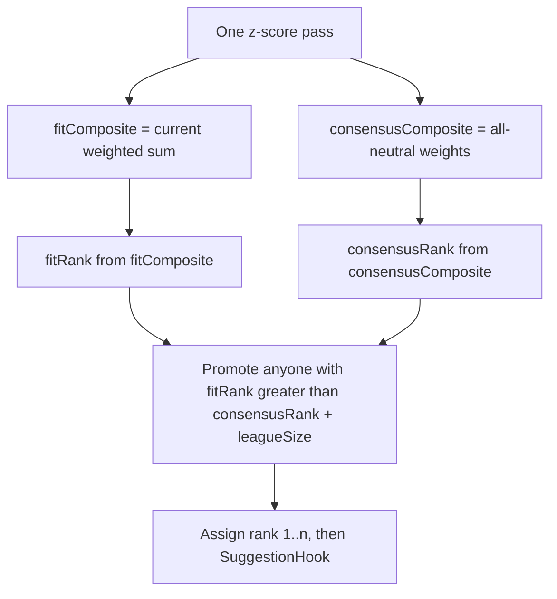

# Ranking availability floor

Stop punt/Need boards from dropping consensus stars to late rounds by adding an availability floor in `rank()`, while leaving specialist rises intact. Backend-only: `POST /rank` order and new rank fields change; UI can keep rendering the list as it does today.

## The pitfall

[`rank()`](app/core/src/ranker.ts) is a weighted z-score over the full CSV universe. **Punt = weight 0**, **Need = 1.5**. The draft UI then treats that order as availability: [`partitionByRound`](app/core/src/partition.ts) and simple-view `players[overall - 1]` assume BPA off this list.

On the real 2025-26 board, named **Fortress** (Need FG%/REB/BLK/PTS, punt FT%) does exactly what you saw:

- Stephen Curry 10 -> 38 (round 4)
- James Harden 18 -> 73 (round 7)
- With Need intensity 2: Harden 18 -> 97, Curry 10 -> 61

They are still first-round talents in every real room. The punt board makes them look like late-round names.

Punt-only (no Need) is milder (Harden 18 -> 52). Need + punt + intensity is the worst case. Other named builds have the same shape: Sniper drops Chet 16 -> 75; Post drops Harden 18 -> 59 and Cade 17 -> 56.

There is no ADP in the CSV. Internal **all-neutral rank on the same enabled cats** is the honest consensus proxy. Do not invent ADP.

## If we had ADP

ADP is what the rest of the room actually does. All-neutral z-rank is only a stand-in: it will mis-order name-brand, injured, or recency-boosted players (Kawhi 4th / Lauri 8th on our board are not market ADP).

What would change, and what would not:

- **Floor key.** Promote against ADP overall pick (or ADP rank) instead of `consensusRank`. Same splice, `floor = adp + slack`. Slack can shrink because the market already prices some punt drafters; one full round is a consensus-proxy fudge.
- **Reaches become honest.** Gobert 85 -> 10 on Fortress is a reach vs ADP ~40-50. Still do **not** pull him down: punt boards exist to take that player early. Expose `adp` so UI can chip "reach" / "value" instead of greying him off the R1 card.
- **UI that is circular today becomes legal.** "Likely gone by your pick" using ADP vs `draftSlot` overall. "ADP 45, don't spend pick 18" on a poor-fit star. Dual column: fit rank vs ADP. None of that should be faked from this board's ranks.
- **Data, not ranker math.** New ADP CSV/API mapped to Basketball-Reference `playerId`. Fit composite, punt/Need weights, and z-scores stay. `consensusRank` can remain as "our balanced 9-cat board" beside market ADP.
- **Do not build this now.** No ADP file in-repo. Do not derive ADP from `rank`.

## Algorithm (asymmetric floor)

Keep the current fit math. Do not blend fit with consensus (blend also damps intended rises like Giannis/Gobert on Fortress).

1. Compute per-cat z once (unchanged formulas).
2. `fitComposite` = today's `Σ operator_w * profile_w * z` (punt 0, Need 1.5, intensity).
3. `consensusComposite` = same z, all enabled cats at Neutral × intensity 1. Same `enabledCats` as the request (8-cat consensus ignores TOV).
4. Sort twice to get `fitRank` and `consensusRank`.
5. Start from fit order. Walk players in **consensus order** (best first). If a player’s index is worse than `consensusRank + leagueSize`, splice them up to that floor. Only moves **up**. Specialists who rose (Gobert 85 -> 10 on Fortress) stay put.
6. Re-number `rank` 1-based. `composite` stays **fit** so existing composite tests and the table subtitle keep their meaning.

`leagueSize` is one round of slack: a consensus 10th player cannot sit worse than pick 22 in a 12-team league. Tiny Vitest fixtures (`n` << 12) are unaffected, so current goldens should keep passing.

`RankOptions.availabilitySlack` (optional number) overrides slack in tests. Default `profile.leagueSize`. Slack large enough to never bind restores today’s order.

## API / types

[`RankedPlayer`](app/core/src/types.ts) additive fields:

- `fitRank: number` — order by fit composite only
- `consensusRank: number` — all-neutral order on enabled cats
- `composite` / `z` unchanged (fit)
- `rank` — availability-aware order the client already sorts/slices on

[`POST /rank`](app/api/src/index.ts) stays `{ profile }` in, `{ players }` out. No new routes. Request schema unchanged. `draftSlot` still does not feed scoring; `leagueSize` now only sets slack.

## Other ranking shortfalls

**Fix in this PR**

- Consensus-star sink on punt/Need/intensity boards (the reported case).
- Same sink on Sniper (Chet), Post (Harden/Cade), and intensity-2 Fortress.

**Expose now, do not clamp** (inverse problem)

- **Reaches:** Gobert 85 -> 10 and Giannis 47 -> 3 on Fortress look like round-1 names. That is the punt working. Without external ADP we should not pull them down. `consensusRank` on the payload is what a later UI can use to mark a reach.

**Out of scope (document in M2, do not build)**

- Replacement-level / VORP / positional scarcity (already M5-later).
- Minutes floor (stocks specialists with low MP). Not showing up in R1 on current data.
- Null FG%/FT% treated as impact 0 (neutral, not missing).
- Need 1.5 × intensity 2 = 3× weight. Floor covers the star-sink symptom; do not retune stance weights here.
- Taken list / remaining-pool re-z. Still M4 non-goal.

## Tests ([`app/core/src/ranker.test.ts`](app/core/src/ranker.test.ts))

- Existing goldens still pass (punt-FG% big still _rises_; punt vs omit composites; operator doubling).
- All-neutral: `rank === fitRank === consensusRank`.
- Constructed board: elite-FT% guard with a hole in Need cats falls on a Fortress-like profile in `fitRank`, but `rank <= consensusRank + leagueSize`; a poor-FT% big still rises past consensus.
- Season CSV + Fortress: Curry/Harden `rank` within slack; Giannis `rank` better than `consensusRank`.
- 8-cat: consensus omits TOV.
- Optional slack override that disables the floor restores fit order.

## Docs

Update [docs/M2-ranking-engine.md](docs/M2-ranking-engine.md) with the floor, the new fields, and the remaining pitfalls list. Short change note after implementation.

## UI (not in this PR)

No client code required for the fix: [`rankPlayers`](app/client/src/lib/api.ts) already displays API order / `player.rank`.

Call out as follow-ups:

- [`how-it-works`](app/client/src/routes/how-it-works.tsx) still says the composite _is_ the sort. After this, `rank` can differ from `composite` (Harden can show a weak fit score at rank ~30). Scoring copy should mention the consensus floor.
- Table subtitle is `composite` ([`player-table.tsx`](app/client/src/components/draft/player-table.tsx) ~158). Optional: label it as fit, or show `consensusRank` when it differs.
- Simple-view caption (“if the room drafted this board”) becomes more honest for falls; reaches still need a later `consensusRank` chip, not a fake ADP warning.

## Implementation notes

- New branch `cursor/ranking-availability-floor-cf10` from `cursor/quiz-centered-ux-plan-3246`.
- Touch [`app/core/src/ranker.ts`](app/core/src/ranker.ts), [`types.ts`](app/core/src/types.ts), tests, M2. API handler stays a one-liner unless we want a comment.
- Format with `npm run format`. Core vitest is the contract check. No UI verification required for the rank-order change; if we skip how-it-works, say so in the PR.
